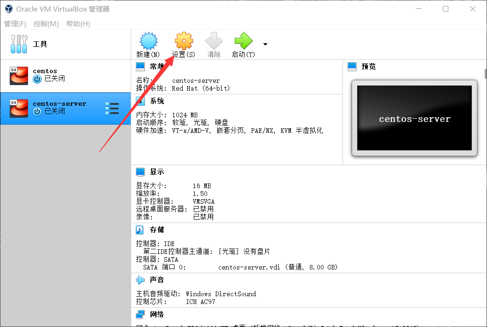
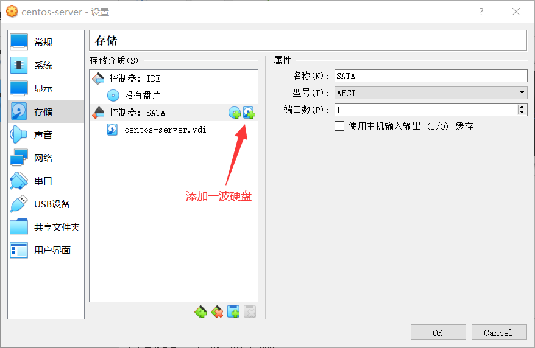
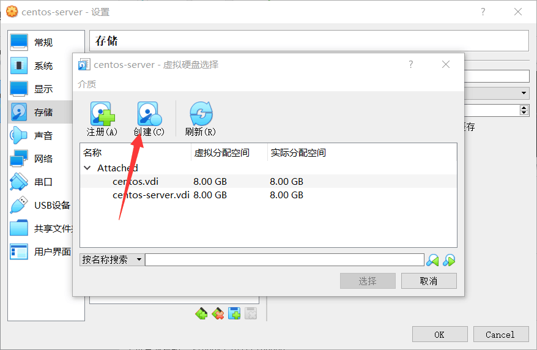
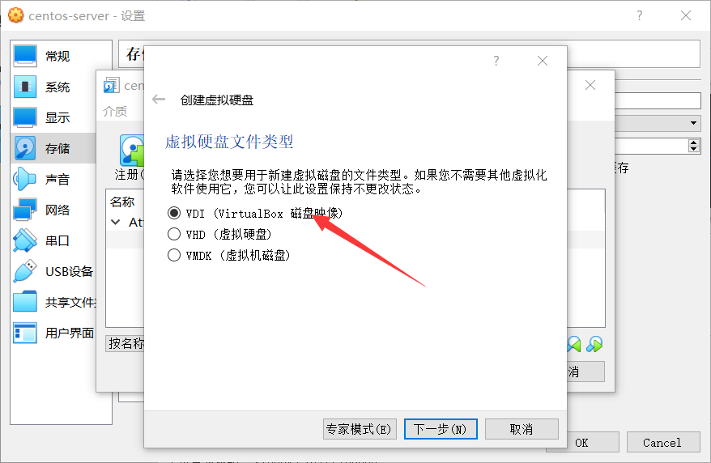
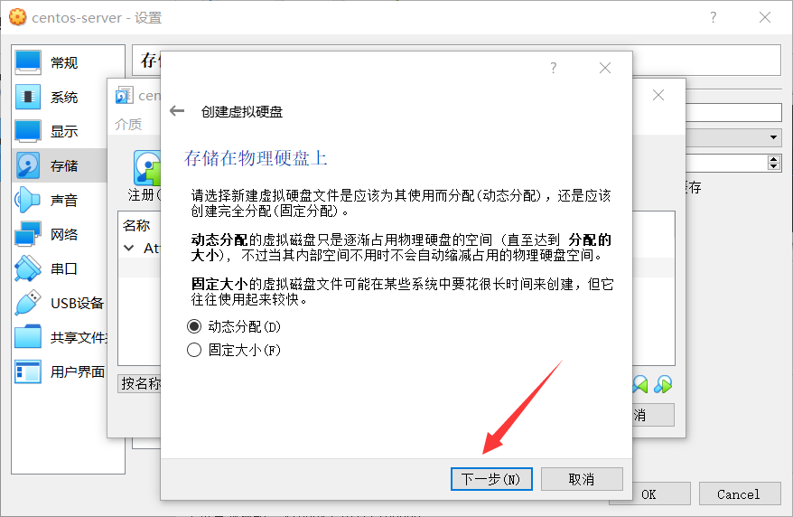
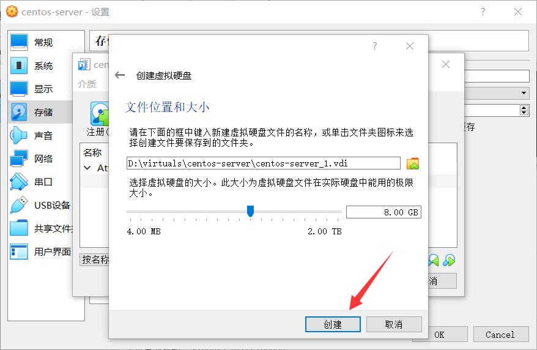
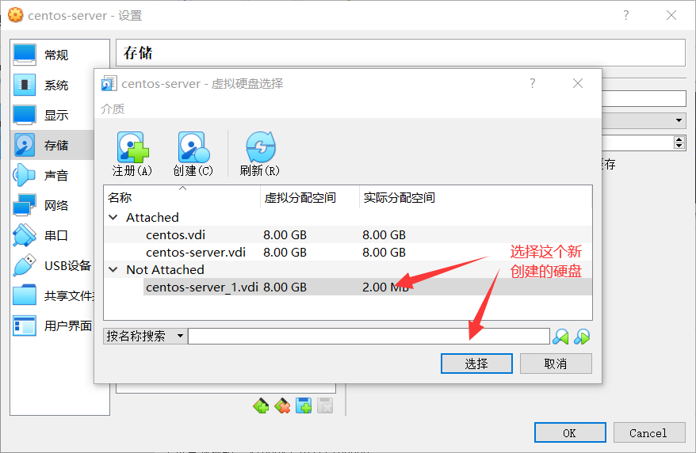
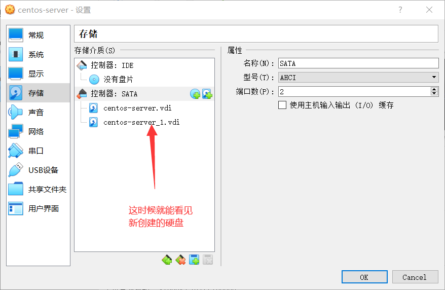

# 10、内存与磁盘管理

## 10-1 查看系统软硬件信息

- **w 命令**：可以查看当前的用户等信息
- **top 命令**：除了显示进程，还能显示 cpu 的一些使用情况，内存使用
- **du -h 命令**：显示目录的大小
- **df -h（human readable）命令**：可以显示文件系统的磁盘空间的使用，能看到文件系统挂载到哪个分区上面
- **free 命令**：内存的使用情况（跟 Top 的头部两行比较相似）；其实 free 命令读取的是 `/proc/meminfo `这个文件里面收集的数据
- **uname 命令**：打印出系统的信息
- 还可以通过文件查看 cpu 的一些信息：**cat /proc/cpuinfo**
- 同理可以通过文件查看 内存 的一些信息：**cat /proc/meminfo**
- **hostname 命令**：查看主机的名字 （其实显示的信息就是 `/etc/hosts` 里面的信息）
- **fdisk -l 命令**：查看磁盘分区

## 10-2 磁盘分区与物理设备和文件系统

### 磁盘分区

- 磁盘分区的英语是 Disk Partition
- 磁盘分区可以把我们的磁盘分为多个区域

### 硬盘

- 现在我们说起电脑中的磁盘，一般是指硬盘
- 硬盘的英语是 Hard Disk；硬盘是磁盘的一种

### 软盘

- 以前还有一种叫做 Soft Disk 的磁盘，就是软盘
- 软盘：存储容量低、读取速度慢、寿命短，差不多已经被淘汰了

### 硬盘的一般分类

- HDD
- SSD

**HDD:**

- Hard Disk Drive，是传统的磁碟型**机械硬盘**（举例会用它）
- 是由盘片、磁头、转轴、控制电机等部分组成，工作时盘片转动，磁头定位在盘片的指定位置上进行读写操作

**SSD:**

- Solid State Drive 的缩写，是**固态硬盘**
- 一般使用 NAND 闪存制成，由于不存在机械部件，读写速度比 HDD 更快

**SSHD**

- 混合硬盘，是 HDD 和 SSD 的结合体

### 什么是磁盘分区？

- 简单地说就是使用分区编辑器（partition editor）在磁盘上划分几个逻辑部分。
- 分区是虚拟的概念（比如把磁盘分 50% 给 windows ，分 50% 给 linux）

### 文件系统

- 严格地说，文件系统是一套实现了数据的存储、分级组织、访问和获取等操作的抽象数据类型（Abstract Data Type）；是操作系统提供的一种抽象，介于软件和磁盘硬件之间
- 在每个分区中，文件都是按照一定方法被存储和组织起来的，这种方法被称为 "文件系统"（file system）
- 使用文件系统来保存数据的时候，不必关心数据实际保存在硬盘（或者光盘）的地址为多少的数据块上，只需记住这个文件的所属目录和文件名
- 文件系统还规定谁有权利访问这个或那个文件
- 现代文件系统有不少都是日志文件系统（Journaling File System）
- 很重要的一条规则：**每个分区只能有一种文件系统**

### Windows 的文件系统

- FAT16
  - 是一种有一定年代的文件系统，可以管理不大于 4 GB 的分区
- FAT32
  - 从 Win 98 开始流行，是 FAT16 的增强版本，可以管理不大于 2 TB 的分区
- NTFS
  - New Technology File System ，在 Win NT 操作系统中首次被使用，可以管理 16 Eo 的分区（也就是近似 16000000000 GB）
  - 比起 FAT 文件系统，NTFS 在系统故障或突然断电时，可以更容易地恢复数据，因为它时日志型文件系统
  - NTFS 还可以对文件进行加密，压缩等

### Linux 的文件系统

- ext2
  - extended，就是第二代文件扩展系统
- ext3
  - 和 ext2 很接近，不过 ext3 是日志型文件系统，所以比起 ext2，ext3 在故障时可以恢复数据
  - ext3 和 ext2 高度兼容
- ext4
  - ext3 的演进，扩大了磁盘分区的大小，支持的存储容量高达 1EB（1073741824GB）
  - 能够批量分配 block 块，极大地提高了读写效率
- xfs
  - 一种高性能地日志文件系统
  - 是 CentOS 7 开始的版本的默认文件管理系统，它的优势在发生意外宕机后尤其明显，它可以快速地恢复可能被破坏地文件，而且强大的日志功能只用花费极低的计算和存储性能，并且它最大可支持的存储容量为 18EB

### 物理设备的命名规则

**/dev 目录**

- dev 是 device 的缩写，表示 “设备”
- /dev 目录的子目录，每一个对应一个外设
- 比如代表光盘驱动器的文件就会出现在这个目录下面

| 硬件设备          | 文件名称             |
| ----------------- | -------------------- |
| IDE 设备          | /dev/hd[a-d]         |
| SATA / SCSI / U盘 | /dev/sd[a-p]         |
| 软驱              | /dev/fd[0-1]         |
| 打印机            | /dev/lp[0-15]        |
| 光驱              | /dev/cdrom           |
| 鼠标              | /dev/mouse           |
| 磁带机            | /dev/st0 或 /dev/ht0 |

- 硬盘的磁盘分区的命名规则：
  - 第一个字母：h 或 s。h 表示 IDE 接口的硬盘（很少见了）；s 表示 SATA 或 SCSI 接口的硬盘
  - 第二个字母：总是 d（drive），表示 “（磁盘）驱动器”
  - 第三个字母：a，b，c，d，等等，表示顺序，但取值是有限值的
  - 系统采用 a~p 来代表 16 块不同的硬盘（默认从 a 开始分配），sda1 是指**第一块硬盘**的**第一个分区**

### 主分区、扩展分区和逻辑分区

**主分区**

- Primary Partition，也称为主磁盘分区，和扩展分区、逻辑分区一样都是一种分区类型
- 主分区中不能再划分为其他类型的分区，每个主分区都相当于一个逻辑磁盘
- 但主分区是直接在硬盘上划分的，逻辑分区则必须建立于扩展分区中
- 早期的 MBR 模式分区只能划分为四个分区，现在 GPT 分区至少可以划分为 128 个主分区，未来很有可能将不存在扩展分区和逻辑分区的概念（因为这俩分区存在的原因就是主分区分的区不太够）
- 一个硬盘的主分区包含操作系统启动所必需的文件和数据的硬盘分区，要在硬盘上安装操作系统，则硬盘必须有一个主分区。
- 主分区或扩展分区的编号从1开始，到4结束。

**扩展分区**

- Extension Partition，严格地说并不是一个实际意义的分区，仅是一个指向下一个分区的指针，这种指针结构将形成一个单项链表

**逻辑分区**

- Logical Partition，是硬盘上一块连续的区域
- 一个硬盘上最多可以有 4 个主分区，而扩展分区上可以划分出多个逻辑驱动器，这些逻辑驱动器没有独立的引导快
- 逻辑分区是从编号 5 开始的

**下面来说一下，Linux 系统安装的时候，如果你选择了手动分区，那么会遇到一些需要划分的分区类型：**

### Swap 分区

- 交换分区，它是 Linux 下的虚拟内存分区；在 windows 中等价的东西叫 “虚拟内存”（Virtual Memory）
- Swap 分区的作用是在物理内存使用完之后，将磁盘空间（也就是 Swap 分区）虚拟成内存来使用
- Swap 分区时一段连续的磁盘空间，并且对用户不可见

### 引导分区

- **/boot** 是引导分区，也就是引导操作系统启动的程序所在的分区。它很重要，里面存放的是开机所需的文件，例如内核、开机菜单和所需的配置文件等等。

### 根分区

- 根分区就是 / 分区，相当于 windows 系统的 C 盘
- 在 Linux 系统里，/ 是最上层的目录

### parted 和 gparted 命令

- **parted 命令：**能显示磁盘分区的信息；
- **gparted 命令：**centos 里面可能没有自带，你需要 yum install gparted；它能够显示磁盘分区的图形界面

## 10-3 字符设备和块设备，dd命令

### 设备文件

- 各种设备以文件的形式存放在 /dev 目录，称为设备（device）文件
- 应用程序可以打开、关闭和读写这些设备文件，完成对设备的操作，就像操作普通的数据文件一样

### 主设备号和从设备号

- 为了管理这些设备，系统为设备编了号，分为**主设备号**和**从设备号**
- 主设备号用来区分不同种类的设备
- 从设备号用来区分同一类型的多个设备

### 字符设备和块设备

- Linux 中 I/O 设备分类两类：**字符设备**和**块设备**

### 字符设备

- 字符设备是指在 I/O 传输过程中以字符为单位进行传输的设备
- 键盘、打印机、串口、调制解调器、tty 等都是典型的字符设备
- 字符设备的文件属性表示是 c（character），如：**c**rw-------
- 字符设备提供连续的数据流，应用程序可以顺序读取，通常不支持随机存取，支持按 字节 / 字符 来读写数据
- /dev/zero，/dev/null 都是字符设备

**/dev/zero**

- 在类 Unix 操作系统中，/dev/zero 是一个特殊的文件，读取它的时候，会提供无限的空字符，即获取的是一串二进制0

### 块设备

- 块设备将信息存储在固定大小的块中，每个块都有自己的地址
- 数据块的大小通常在 512字节 到 32768字节（32 KB）之间
- 块设备的数据读写只能以块的倍数进行
- 块设备支持随机访问，可以在设备的任意位置读取一定长度的数据
- 块设备的文件属性标识是 b（block）
- 硬盘、软盘、CD-ROM 驱动器和闪存都是典型的块设备

### dd 命令

- 用指定大小的块拷贝一个文件，可以在拷贝的同时进行指定的转换
- dd 命令的参数及含义：

| 参数            | 含义                                                   |
| --------------- | ------------------------------------------------------ |
| if=文件名       | 输入文件名，缺省为标准输入。即指定源文件               |
| of=文件名       | 输出文件名，缺省为标准输出。即指定目的文件             |
| ibs=bytes       | 一次读入 bytes 个字节，即指定一个块大小为 bytes 个字节 |
| obs=bytes       | 一次输出 bytes 个字节，即指定一个块大小为 bytes 个字节 |
| bs=bytes        | 同时设置 读入/输出 的块大小为 bytes 个字节             |
| cbs=bytes       | 一次转换 bytes 个字节，即指定转换缓冲区大小            |
| skip=blocks     | 从输入文件开头跳过 blocks 个块后再开始复制             |
| seek=blocks     | 从输出文件开头跳过 blocks 个块后再开始复制             |
| count=blocks    | 仅拷贝 blocks 个块，块大小等于 ibs 或 bs 指定的字节数  |
| conv=conversion | 用指定的参数转换文件，例如 ascii，ebcdic，ibm，等      |

- **dd if=/dev/sda1 of=backup**：将 /dev/sda1 的文件全都拷贝到 backup 中
- **dd if=/dev/zero bs=5M count=10 of=aFile**：再 /dev/zero 中 拷贝 10 块，每块大小为 5 M 的数据到 aFile 中。
- **dd if=/dev/zero bs=5M count=10 seek=20 of=bFile**：用 dd 命令创建带 “空洞” 的文件。它先从 bFile 文件中，跳过开头为 20 块 5 M 大小的空间，再去写入 10 块 5 M 大小的数据

## 10-4 挂载硬件设备与mount和umount命令

### 挂载硬件设备

- 拿到一块新的硬盘存储设备后，需要先分区，然后再格式化文件系统，最后才能挂载并正常使用
- 当然了，也可以不对硬盘进行分区，但必须进行格式化

### 格式化

- 格式化是指对磁盘或磁盘中的分区进行初始化的一种操作
- 格式化会清除原有的数据，然后指定文件系统

### 挂载

- 需要使用硬盘设备或分区中的数据时，需要先将其与一个已存在的目录文件进行关联
- 这个关联动作就是 **挂载**

### mount 命令

- mount 命令用于挂载文件系统
- 命令格式为：mount 文件系统 挂载目录
- 挂载是在使用硬件设备前所执行的最后一步操作

| 参数 | 作用                                   |
| ---- | -------------------------------------- |
| -t   | 指定文件系统的类型                     |
| -a   | 挂在所有在 /etc/fstab 中定义的文件系统 |

- **mount /dev/sda1 /backup**：将 /dev/sda1 这个文件系统挂载到 /backup 这个文件目录中

### /etc/fstab

- mount 挂载的文件系统，在系统重启后挂载就会失效
- 要永久挂载，就要用以下格式写入 **/etc/fstab** 文件：
- **设备文件 挂载目录 格式类型 权限选项 是否备份 是否自检**

| 字段     | 含义                                                         |
| -------- | ------------------------------------------------------------ |
| 设备文件 | 一般是设备的完整路径，也可以用唯一识别码（UUID，Universally Unique Identifier） |
| 挂载目录 | 指定要挂载到的目录，需要挂载前创建好                         |
| 格式类型 | 指定文件系统的格式，比如 Ext3，Ext4，XFS，SWAP，iso9660（此为光盘设备），等 |
| 权限选项 | 若设置为 defaults，则默认权限为：rw，suid，dev，exec，auto，nouser，async |
| 是否备份 | 若为 1 则开机后使用 dump 进行磁盘备份，为 0 则不备份         |
| 是否自检 | 若为 1 则开机后自动进行磁盘自检，为 0 则不自检               |

### umount 命令

- umount 命令用于撤销已经挂载的设备文件
- 命令格式：**umount [挂载点/设备文件]**
- 比如上面的挂载目录 backup：**umount backup**

## 10-5 添加硬盘设备和交换分区，fdisk和mkfs命令

### 添加硬盘设备

















- 这个时候运行 **ls -l /dev/sd?**，就会出现下面的结果：

```shell
brw-rw----. 1 root disk 8, 0 Seq 19 19L13 /dev/sda
brw-rw----. 1 root disk 8, 16 Seq 19 19L13 /dev/sdb
```

### fdisk 命令

- fdisk 命令用于管理磁盘分区
- 命令格式为 “fdisk [磁盘名称]”
- 集添加、删除、转换、分区等功能于一身
- 它的参数：

| 参数 | 作用                   |
| ---- | ---------------------- |
| m    | 查看全部可用的参数     |
| n    | 添加新的分区           |
| d    | 删除某个分区信息       |
| l    | 列出所有可用的分区类型 |
| t    | 改变某个分区的类型     |
| p    | 查看分区信息           |
| w    | 保存并退出             |
| q    | 不保存直接退出         |

```shell
# 接下来用 fdisk 作用我们添加的磁盘
fdisk /dev/sdb
# 接下来就能按上面的参数来操作（比如添加一个分区就按 n）
# 如果你添加了分区之后，就能按 p 来查看分区的信息了。
```

```shell
# 添加了硬盘以后：
ls -l /dev/sd?

# 就能看到第二个磁盘的第一个分区
brw-rw----. 1 root disk 8, 0 Seq 19 19L13 /dev/sda
brw-rw----. 1 root disk 8, 16 Seq 19 19L13 /dev/sdb
brw-rw----. 1 root disk 8, 16 Seq 19 19L13 /dev/sdb1
```

### mkfs 命令

- mkfs 是 make file system 的缩写，表示 “制作文件系统”
- mkfs 命令用于格式化，指定文件系统
- mkfs 系列命令：**mkfs.文件系统名称**

```shell
# 在第二块硬盘的第一个分区上格式化
mkfs.xfs /dev/sdb1

# 然后将文件系统挂载到挂载目录上
mkdir /newFS
mount /dev/sdb1 /newFS/
```

### 添加交换分区

```shell
# 还是从 sdb 这个硬盘上进行分区
fdisk /dev/sdb
# 然后按 n 来添加个分区
# 添加完了以后就会有 /dev/sdb2

# swap 分区有专门的文件系统格式，所以要用 mkswap 命令
mkswap /dev/sdb2

# 用 swapon 把刚刚的新添加的分区加入到swap分区里面（不能再用 mount）
swapon /dev/sdb2

# 然后运行 free -m 就能看到 Swap 分区的容量变大了
# 用 mount 挂载的文件系统重启会失效，要想永久挂载，要修改 /dev/fstab
```

`/dev/fstab`

```shell
/dev/sdb1   /newFS   xfs   defaults   0  0
/dev/sdb2   swap     swap  defaults   0  0 
```

## 10-6 磁盘容量配额，quota命令集

### 磁盘容量配额

- 使用磁盘容量配额服务来限制某位用户或某个用户组
- 针对特定文件夹可以使用的最大硬盘空间或最大文件个数
- 一旦达到这个最大值就不再允许继续使用

### quota 命令集

- quota 表示 “定额；限额；配额”
- quota 是一个磁盘容量配额服务**程序包**
- 可以限制用户的硬盘可用容量或所能创建的最大文件个数，等等
- 软限制：当达到软限制时会提示用户，但仍允许用户在限定的额度内继续使用
- 硬限制：当达到硬限制时会提示用户，且强制终止操作
- 存储设备默认没有开启对 quota 的支持，需要编辑 **/etc/fstab**

`/etc/fstab`

```shell
# 在 default 后面加上 uquota
UUID=ceda75b5-efdc-40d3-a374-4eca5f733d13    /boot   xfs    default,uquota   0   0  
```

- 然后重启系统：**reboot**
- 然后运行 **mount | grep boot** ，看看能不能看到 **usrquota** 字样
- 然后再创建一个检查 quota 这个磁盘容量的配额效果的用户：

```shell
# 创建个用户
useradd thomas

# 为 /boot 这个目录增加其他人也可以写的权限，保证 thomas 能够写
chmod -Rf o+w /boot
```

### xfs_quota 命令

- 是针对 XFS 文件系统来管理 quota 磁盘容量配额服务而设计的命令
- 命令格式为 ：**xfs_quota [参数] 配额 文件系统**

```shell
# 限制 thomas 这个用户在 /boot 目录中，硬盘的使用量为：软限制（bsoft）为 4m，硬限制（bhard）为 7m，能创建的文件数量的软限制（isoft）为 5个，能创建的文件数量的硬限制（ihard）为 9个
xfs_quota -x -c 'limit bsoft=4m bhard=7m isoft=5 ihard=9 thomas' /boot

# 然后我们可以看看磁盘的配额情况
xfs_quota -x -c report /boot
```

### edquota 命令

- edit quota，用于编辑用户的 quota 配额限制
- 命令格式为：**edquota [参数] [用户]**

```shell
# 输入下面这句，就能编辑磁盘配额
edquota -u thomas
```

