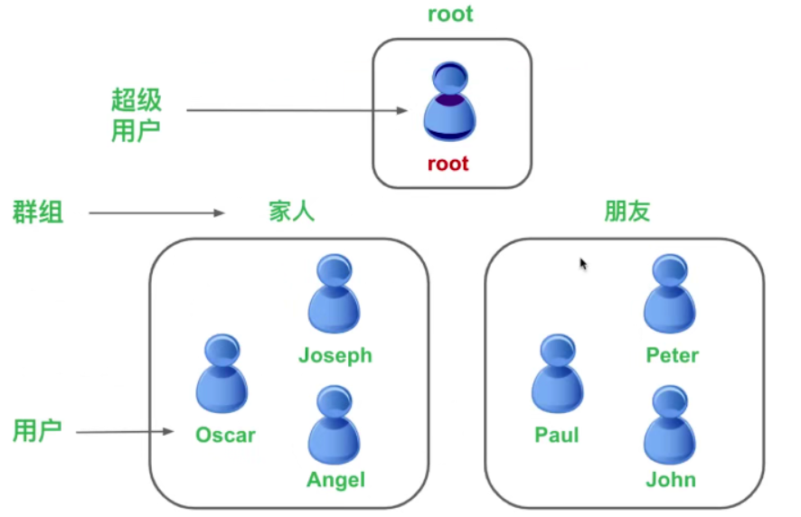

# 2、Linux基础知识和命令

## 2-1 关于终端界面

问题：

- 为什么要发明终端，而不是一开始就用图形界面？
  - 因为计算机一开始的时候计算能力不强。
- 为什么需要终端？
  - 为了节省时间

```
例子：一个目录里有多个文件，你想知道有多少个 JPEG 类型的图片。在图形界面里可能会有点麻烦；
在终端里一句命令搞定：ls -l | grep jpg | wc -l
```

### 什么是 tty？

- 在 Linux 中， TTY 也许是跟终端有关系的最为混乱的术语
- TTY 是 TeleTYpe 的一个缩写
- Teletypes，或者 teletypewriters ，原来指的是电传打字机
- 我的理解，tty就是个真正的全屏幕终端

### 登录 tty 的快捷键

- ctrl + alt + f1：**回到图形界面**
- ctrl + alt + f2：terminal 1 (:0  大致等于 tty1)
- ctrl + alt + f3：terminal 2（tty2）
- ctrl + alt + f4：terminal 3（tty3）
- ctrl + alt + f5：terminal 4（tty4）
- ctrl + alt + f6：terminal 5（tty5）

## 2-2 命令行

- 命令行：Command Line。

### 命令行提示符

- **[konglinghao@localhost ~]$** 是命令提示符， 可以看成电脑在对你打招呼，说 “你好”，提示你要开始写东西了。
- konglinghao 是当前用户的名字。Linux 是多用户的操作系统（windows 也是）。
- @ 后面的是所在的域。localhost 是主机的名字。
- ~ 是当前所在目录的名字，会随着用户进入不同目录而改变
- ~ 表示当前用户的家目录（home directory）
- $ 指示你所具有的权限
  - $表示普通用户，拥有有限的权限
  - #表示超级用户，拥有所有权限

### 简单的命令

- date 用于显示当前时间
- ls 是 list 的缩写，用于列出当前目录下的文件和目录

### 命令的参数

- 参数是写在命令之后的一些补充选项。命令和参数之间要有空格隔开。
- 格式：command parameters
- 参数里可以包含多个参数，由空格隔开
- 参数也可以包含数字，字母，等等
- 参数没有固定的格式，但是一般来说还是遵循一定的规范

### 短参数（一个字母）

- 最常用的参数形式就是一个短横线后接一个字母：command -p
- 一次可以加好几个短参数，可以用空格隔开：command -p -a -T -c
- 多个短参数可以合并到一起：command -paTc
- 字母的大小写有区别，大写的 T 和小写的 t 通常含义不同
- 举一个实际的例子：ls -a；参数中的 a 是 all 的意思（包含隐藏文件，linux 里面以 . 开头的就是隐藏文件）

### 长参数（多个字母）

- 长参数没有短参数那么常用，但也是很有用的，以两个短横线开始
- 格式：command --parameter
- 多个长参数不能合并写，要用空格隔开：command --parameter1 --parameter2
- 可以组合使用短参数和长参数：command -paTc --parameter1
- 有时候同一个意义的参数有长参数和短参数两种形式：ls -a 和 ls --all 意思一样

### 参数赋值

- 有一些参数需要赋值。短参数和长参数赋值方式不一样
- 短参数赋值：command -p 19
- 长参数赋值：command --parameter=10

## 2-3 如何查找命令和命令的历史记录

### 如何找到一个命令

- 有时候想不起来一个命令到底是如何拼写的
- 用 Tab 键来补全命令
- Tab 键还可以不全文件名、路径名：按**两次** tab 键

### 命令的历史记录

- 向上键：按时间顺序向前查找用过的命令
- 向下键：按时间顺序向后查找用过的命令
- **ctrl + r**：用于查找使用过的命令

### history 命令

- history 是英语 “历史，历史记录” 的意思
- 用于列出之前用过的所有命令
- 可以用 **!编号** 这样的格式来重新运行 history 输出中对应编号的命令

### 一些实用的快捷键

- Ctrl + L 用于清理终端的内容，就是清屏的作用。同 clear 命令。
- Ctrl + D 给终端传递 EOF（End Of Life ，文件结束符）。
- Shift + PgUp 用于向上滚屏，与鼠标的滚轮向上滚屏是一个效果。
- Shift + PgDn 用于向下滚屏，与鼠标的滚轮向下滚屏是一个效果。
- Ctrl + U 用于删除光标左侧的内容。
- Ctrl + K 用于删除光标右侧的内容。

## 2-4 文件和目录组织命令

### 文件的组织

- 不像 windows 里面那样有 C盘，E盘这些，Linux 把所有东西都放到一个地方。
- Linux 把文件分为普通文件和特殊文件

### 普通文件

- 文本类型的文件（.txt，.doc，.odt 等）。
- 声音文件（.mp3 等），还有程序。
- 这样的文件在 windows 里也有。

### 特殊文件

- 其他一些文件是特殊的，因为它们表示一些东西
- 例如，光盘驱动器就是这类特殊的文件

**Linux 中一切皆是文件，连目录也是文件。**

### 根目录

Windows 中的根目录：

- windows 中，可以有好几个根目录
- C盘（C:/）是硬盘的根目录（加入没有把 C盘 磁盘分区的话）
- H盘可能是光盘驱动器的根目录

Linux 的根目录：

- Linux 有且只有一个根目录，就是 / （斜杠）
- Linux 中没有比根目录再高一阶的目录，没有目录包含根目录
- 根目录就是 Linux 最顶层的目录：“万有之源，斜杠青年”

### 目录结构

Windows 目录结构：

- Windows 下，一个目录的形式是这样的 C:\Program Files\Baidu
- Baidu 这个目录是 Program Files 这个目录的一个子目录
- Program Files 是 C盘 这个根目录的一个子目录
- Windows 中用反斜杠 \ 来标明目录的层级与包含关系

Linux 目录结构：

- Linux 中用斜杠 / 来标明目录的层级与包含关系（只有斜杠 / 这个根目录）
- Linux 的目录形式是这样的：/usr/bin
- bin 是 usr 目录的子目录，usr 是 / 这个根目录的子目录

## 2-5 Linux 的根目录的直属子目录

### bin

- binary，表示 “二进制文件”
- （我们知道可执行文件是二进制的）
- bin 目录包含了会被所有用户使用的可执行程序

### boot

- 启动；包含与 Linux 启动密切相关的文件

### dev

- device (设备)；包含外设。它里面的子目录，每一个对应一个外设。
- 比如代表我们的光盘驱动器的文件就会出现在这个目录下面

### etc

- etc：有点不能顾名思义了。etc 是法语 et cetera 的缩写
- 翻译成英语就是 and so on ，表示 "...等等"
- etc 目录包含系统的配置文件
- 至于为什么在 /etc 下面存放配置文件，按照原始的 Unix 的说法，这下面放的都是一堆零零碎碎的东西，就叫 etc 好了，是 **历史遗留**

### home

- 家；用户的私人目录
- 在 home 目录中，我们放置私人的文件，类似 windows 中的 Documents 文件夹，也叫 "我的文档"
- Linux 中的每个用户都在 home 目录下有一个私人目录（除了大管家用户 root ），root 用户拥有所有权限，比较 “任性”，跟普通用户不住在一起。
- 我的用户名是 konglinghao ，那么我的私人目录就是 /home/konglinghao

### lib

- library（库）；包含被程序所调用的库文件，例如 .so 结尾的文件
- 在 windows 下这样的库文件则是以 .dll 结尾

### media

- media（媒体）；可移动的外设（USB盘，SD卡，DVD，光盘 等等）插入电脑时，可以通过 media 的子目录来访问这些外设中的内容

### mnt

- mount（挂载）；有点类似于 media 目录，但一般用于临时挂载一些装置

### opt

- optional application software package（可选的应用软件包）；用于安装多数第三方软件和插件

### root

- 根；超级用户 root 的家目录；一般的用户的家目录位于 /home 下，root 用户是个例外

### sbin

- system binary（系统二进制文件）；包含系统级的重要可执行程序

### srv

- service（服务）；包含一些网络服务启动之后所需要取用的数据

### tmp

- temporary（临时的）；普通用户和程序存放临时文件的地方

### usr

- Unix Software Resource （Unix 操作系统软件资源）；类似 etc，也是 **历史遗留** 的命名；
- 是最庞大的文件之一
- 类似 windows 中的 C:\Windows 和 C:\Program Files 这两个文件夹的集合
- usr 目录里安装了大部分用户要调用的程序

### var

- variable（动态的，可变的）；通常包含程序的数据，比如 log（日志）文件

## 2-6 pwd 命令和 which 命令

### pwd 命令

- 显示当前目录的路径
- 刚打开一个终端，你将位于你的用户家目录 ~ 中
- 如果用户是 konglinghao ，那么 ~ 这个目录就是 /home/konglinghao 这个目录
- 通常来说，命令行提示符会告诉你目前位于那个目录下（还有个方法，那就是 **pwd 命令**）
- pwd（Print Working Directory）；打印当前工作目录

### which 命令

- 获取命令的可执行文件的位置
- 不是一个必不可少的命令，平时用到它的机会也不多
- Linux 下，**每一条命令其实对应了一个可执行程序**；
- 在终端中输入命令，按回车的时候，就是执行了对应的那个程序；
- 一个命令，其实只不过是我们随时可以调用的程序罢了
- which 命令接收一个参数，是你想知道其可执行程序位于哪里的命令
- windows 可执行程序以 .exe 结尾，Linux 中一般是没有后缀名的

## 2-8 目录相关的命令

### ls 命令

- 列出文件和目录

参数：

- -a：显示所有文件和目录，包括隐藏的
  - 以 . 开头的文件是隐藏文件
  - 不包括**开头**的两个 . 和 ..
  - . （一个点）表示当前目录；..（两个点）表示上一级目录
  - 大写的参数 -A ，它的作用和小写的 -a 几乎一样，唯一不同之处在于 -A 不列出 . 和 ..
- -l：详细列表
  - -l 参数使得 ls 命令列出一个显示文件和目录的详细信息的列表
  - 每一个文件或目录都有对应的一行信息
  - 
  - 第一列：文件权限：drwxr-xr-x 之类
  - 第二列：链接的数目：2，1之类
  - 第三列：文件的所有者的名称
  - 第四列：文件所在的群组
  - 第五列：文件大小：单位是 octet，也就是 byte
  - 第六-八列：文件最近修改时间
  - 最后一列：文件或目录的名称
- -h：以 Ko，Mo，Go 的形式显示文件大小
  - 仅用 ls -l，列出的文件详细信息中，文件大小是以字节为单位的
  - 参数 -h（human readable，适合人类阅读的）
  - 命令形式：ls -lh
- -t：按文件最近一次修改时间排序
  - time
  - 命令形式：ls -lt
  - ls 的常用参数合并在一起使用，效果是叠加的：ls -lath

### cd 命令

- 切换目录（change directory）
- cd 命令后面接的参数就是一个：你要去的那个目录的路径
- 回到上一级目录：cd ..
- 挥到上一级目录的上一级目录：cd ../..

### du 命令

- disk usage（磁盘占用）；显示目录包含的文件大小
- 项目 ls -l 命令，du 命令统计的才是真正文件的大小
- du 命令会深入遍历每个目录的子目录，统计所有文件的大小（单位是 字节）

参数：

- -h：以 Ko，Mo，Go 的形式显示文件大小
  - 命令形式：du -h
- -a：显示文件和目录的大小
  - 默认情况下，du 命令只显示目录的大小
  - 如果加上 -a 参数，则会显示目录和文件的大小
- -s（summarize）：只显示总计大小
  - 只想知道当前目录的总大小，可以使用 -s 参数

## 2-9 浏览和创建文件

### cat 和 less 命令

- 显示文件内容

/var/log 中有很多日志文件

- /var 这个目录通常包含程序的数据
- log 文件通常会记录电脑中发生了什么事

### cat 命令

- concatenate（连接/串联，理解成字符串首尾相接，全显示出来）；一次性显示文件的所有内容
- 命令形式：命令后加上想要显示的文件路径（可以用空格分开多个文件路径，这样就可以打印多个文件的内容）

参数：

- -n，这样就能在每一行前面加上数字，显示多少行

### less 命令

- 分页显示文件内容
- 其实还有个命令是 more，表示更多；和 less 命令功能类似，没有 less 那么强大，比如 more 命令不能往后翻页，只能往前（这是什么鬼？！）。

less 命令中最基本最常用的快捷键：

- 空格键：文件内容读取下一个终端屏幕的行数；与键盘上的 PageDown（下一页）效果一样
- 回车键：文件内容读取下一行，也就是前进一行
- d 键：前进半页（半个屏幕）
- b 键：后退一页。与键盘上的 PageUp（上一页）效果一样
- y 键：向上一行，和键盘上向上键功能一样
- u 键：后退半页
- q 键：退出 less

略显高级的快捷键（不那么常用）：

- = 号：显示你在文件中的什么位置（文件中的第几行到第几行/一共行数）
- h 键：显示帮助文档
- q 键：退出帮助文档
- / 键：进入搜索模式（n 跳到下一个符合项目；N 跳到上一个符合项目）

### head 命令

- 显示文件开头几行，默认显示头10行
- head -n 5 filename ，表示显示头5行

### tail 命令

- 显示文件结尾几行，默认显示尾10行
- tail -n 5 filename，表示显示尾5行
- tail 命令还可以配合 -f 参数来实时追踪文件的更新（tail -f filename）
  - 默认的，tail -f 会没过1秒检查一下文件是否有新内容
  - 可以指定间隔检查的秒数，用 -s 参数：tail -f -s 4 filename

### touch 命令

- 创建一个空白文件
- 事实上，Linux 没有一个命令是专门用来创建一个空白文件的
- touch 命令其实一开始的设计初衷是修改文件的时间戳（创建时间或修改时间）
- 就是说，我**碰**一下那个文件，让电脑以为我刚修改过。
- 如果 touch 命令后面跟着的文件名是不存在的文件，它会新建一个
- 若想创建一个名字带空格的文件（用双引号包住名字）：touch "new file"

### mkdir 命令

- make directory，创建一个目录
- 可以用 -p 参数来递归创建目录结构：mkdir -p one/two/three

## 2-10 文件的复制，移动，删除，链接

### cp 命令

- copy，用来拷贝文件；可以拷贝单个文件，多个文件，目录；
- 命令形式：cp new_file new_file_copy，将 new_file 复制一份，名字叫 new_file_copy

复制文件到另一个目录

- cp new_file one/
- cp new_file one/new_file_copy（拷贝的同时不希望名字相同）

拷贝目录

- 在 cp 命令之后加上 -r 或者 -R 参数
- r 大写和小写作用是一样的，都表示 recursive（递归）
- 因为拷贝的时候，目录中的所有内容（子目录和文件）都会被拷贝
- 命令形式：cp -r one one_copy

使用通配符 *

- cp *.txt folder ：把当前目录下所有 txt 文件拷贝到 folder 目录中
- cp ha* folder：把当前目录以 ha 开头的文件都拷贝到 folder 目录中

### mv 命令

- move，移动文件。有两个功能：
- **移动文件（目录）**
- **重命名文件（或目录）**

移动文件

- 与 cp 命令用法类似，不同的是 cp 命令会复制当前文件；而 mv 命令则是单纯的移动，并不会制作副本
- 命令形式：mv new_file one；将 new_file 移动到 one 目录；
- 也可以配合通配符来使用：**mv *.txt one**：将当前目录下所有 txt 文件移动到 one 目录

重命名文件

- 事实上，Linux 中没有一个专门的命令用于重命名文件
- 经过 mv 移动之后，原始文件变成了新的名字的文件
- 命令形式：mv new_file renamed file

### rm 命令

- remove，删除文件和目录
- rm 命令可以删除一个文件、多个文件、目录，甚至是整个 Linux 系统
- 命令形式：rm new_file_copy

参数：

- -i （inform，通知，告知）参数：向用户确认是否删除
  - y：删
  - n：不删
- -f （force）参数：不会询问是否删除，强制删除
- -r 参数：递归地删除其包含的子目录和文件（用来删除目录）

**千万不要这么做：rm -rf /* 或者 rm -rf /**，如果用管理员身份运行这条命令，那 Linux 系统就没了

### ln 命令

- link（链接）；用于在文件之间创建链接
- 链接用熟悉的词来说：**快捷方式**
- linux 有两种链接类型：
- **Physical link：物理链接或硬链接**
- **Symbolic link：符号链接或软链接**

在硬盘上存储时，大致来说，每个文件有两个部分：**文件名**和**文件内容**；文件名的列表时存储在硬盘的其它地方的，和文件内容分开存放，这样方便 linux 管理；

为什么上面用**大致来说**呢？其实每个文件有三部分：**文件名**，**权限**和**文件内容**，上面只是简化而已。

每个文件的文件内容被分配到一个标示号码，就是 inode，因此每个文件名都绑定到它的文件内容（用 inode 标识）。

\

**创建硬链接：**


- 硬链接原理：使链接的两个文件共享同样文件内容，就是同样的inode
- 一旦文件1和文件2之间有了硬链接，那么修改文件1或文件2，修改的使相同的一块内容，只不过我们可以用两个文件名来取到文件内容
- 硬链接的缺陷：**只能创建指向文件的硬链接，不能创建指向目录的**；（通过一些参数的修改，也可以指向目录的硬链接，但比较复杂）
- 软链接可以指向文件或目录。对于目录，一般都是用软链接
- 创建一个文件 file2，使之成为 file1 的硬链接：**ln file1 file2**
- 可以使用 ls -i 命令查看一下文件（-i 参数可以显示文件的 inode）
- 如果用 rm file1 来删除 file1，对 file2 没有影响，也就是说，对于硬链接，删除任意一方的文件共同指向的文件内容并不会从硬盘上被删除；只有既删除 file1 又删除 file2 ，它们共同指向的文件内容才会消失，也就是 inode 才会被删掉。

**创建软链接：**


- 软链接才真正像我们在 windows 下的快捷方式，原理很相似
- 创建硬链接时 ln 不带任何参数，创建软链接时需要加上 -s 参数；s 是 symbolic（符号的）的缩写
- **ln -s file1 file2** ：创建了file1 的软链接 file2
- file2 前面的权限那里的第一个字母变成了 l，表示 link（链接）
- file2 的 inode 和 file2 不同（指向的文件内容不同）
- 其实 file2 这个软链接只是 file1 的一个快捷方式；

软链接特点：

- 如果删除 file2，file1 不会受到影响
- 如果删除 file1，file2 就会变成死链接，因为指向的文件不见了
- **软链接可以指向目录，硬链接不行**

## 2-11 用户和权限

### Linux 下的用户组织

- 在 Linux 中，理论上来说，我们可以创建无数个用户，但是这些用户是被划分到不同的群组里面的；有一个用户，名叫 root，是一个很特殊的用户。
- 在 Linux 系统中，root 用户可以做任何事情
- Linux 中的用户的一般可能形式：



- 在我们装完 Linux 系统后，假如我们创建的个人用户叫做 konglinghao ，那么这时系统中只有两个用户：root 和 konglinghao；root 用户是默认会创建的，因为是系统的大管家，超级用户；我们只在必要时才会切换为 root 身份，其它时候，都是用有限权限的用户，例如 konglinghao ；这增加了 linux 的安全性；

### sudo 命令

- Substitute（替换，代替，替身） User Do，**代替用户来执行...**的意思；暂时成为 root
- 命令形式：sudo command

### sudo su 命令

- 一直成为 root 用户

### exit 命令

- 退出 root 用户

### 用户管理的命令

- 学习一些只有 root 用户才能运行的命令
- useradd 就是其中的命令之一

### useradd 命令

- 添加新用户
- 用法：useradd thomas

### passwd 命令

- 修改密码；将新创建的用户增加密码，这样新用户就能用了。
- 用法：passwd thomas

### userdel 命令

- 删除用户
- 用法：userdel thomas
- 单单用 userdel 命令，不加参数（如上面这句），只会删除用户，但是不会删除在 /home 目录中的用户家目录
- 如果想要抄家，可以在后面加上 -r 或 --remove 这个参数
- **userdel -r thomas** 或 **userdel --remove thomas**

## 2-12 群组的管理和文件权限管理

### 群组管理的命令

- Linux 中每一个用户都属于一个特定的群组
- 如果你不设置用户的群组，默认会创建一个和它的用户名一样的群组，并且把这个用户划归到这个群组

### groupadd 命令

- 添加一个新的群组
- 用法：groupadd friends，创建一个名为 friend 的群组

### usermod 命令

- user modify，用于修改用户的账户

参数：

- -l：对用户重命名。/home 中的用户家目录名不改变，需要手动修改
- -g：修改用户所在群组
- **usermod -g friend thomas**，把 thomas 这个用户放到 friend 这个群组里面
- 用 groups 命令可以获知一个用户属于哪个（些）群组
  - groups 的用法就是后接用户名就行。
- -G：可以将用户添加到多个群组：usermod -G friends,happy,funny thomas：将 thomas 这个用户添加到三个群组里
- 在配合 -g 或者 -G 时，它会把用户从原先的群组里剔除，加入到新的群组
- 如果不想离开原先的群组，又想加入新的群组，可以在 -G 参数的基础上加上 -a（append） 参数

### groupdel 命令

- 删除群组
- 用法：groupdel happy

### 修改文件的所有者和群组

- 只有 root 用户可以修改一个文件的所有者和群组
- 我们在家目录里创建一个文件，例如 file.txt，现在想把这个文件转让给别的用户（如 thomas），用 chown 命令

### chown 命令

- change owner，改变文件的所有者，需要 root 用户才能运行
- 用户：chown thomas file.txt：将 file.txt 这个文件转让给 thomas
- file.txt 的所有者改为 thomas 之后，所在群组是不变的，还是 konglinghao 如：

```javascript
-rw-rw-r--. 1 thomas      konglinghao  0 Sep  8 19:04 file.txt
```

参数：

- -R 参数：使被修改的目录的所有子目录和子文件都改变所有者
- chown -R konglinghao:konglinghao /home/thomas：把用户 thomas 的家目录的所有子目录和文件都占为己有

### chgrp 命令

- change group，改变文件的群组
- 用法：chgrp thomas file.txt：将 file.txt 的文件的群在改为 thomas
- 其实，chown 命令也可以改变文件的群组，用法：chown konglinghao:friends file.txt：意思就是 把 file.txt 文件的所有者改为 konglinghao ，群组改为 firends

### chmod 命令

- 修改访问权限

## 2-13 文件权限管理

### 权限的原理：

- Linux 系统里，每个文件和目录都有一列权限属性
- 访问权限指明了谁有读的权利，谁有修改的权利，谁有运行的权利
- 文件信息的第一列比较复杂，可以看到不少 d，r，w，l，x 等字母
- 不细分的话，这些可以统称为文件访问权限符
- d：directory，就是说这是一个目录
- l：link，就是说这是一个链接
- r：read，就是说可以读这个文件
- w：write，就是说可以 写/修改 这个文件
- x：execute，就是说可以运行这个文件
- 如果 x 权限在一个目录上，那么表示的是这个目录可以被读，就是说可以打开此目录来看其子目录和子文件，如果同时有 r 权限的话；
- 如果相应位置有字母，表示有相应权限。短横 - ，表示没有相应权限
- 在最后面可能有一个点，这是 SELinux 的安全标签
- 为什么我们看到这一排有好多个重复出现的 r，w 和 x 呢？那是因为访问权限是按照用户来划分的；
- 如：drwxr-xr-x.  第一个字母是属性（这里这个说明是个目录），后面开始就按照三个一组划分，分别代表：所有者、群组用户、其它用户 的权限
- 第一组 rwx 表示文件的所有者对于此文件的访问权限
- 第二组 rwx 表示文件所属的群组的其他用户对于此文件的访问权限
- 第三组 rwx 表示除前两组之外的其他用户对于此文件的访问权限

### chmod 命令

- change mode，修改文件的访问权限
- chmod 不需要是 root 用户才能运行，只要你是此文件所有者，就可以用 chmod 来修改文件的访问权限

### chmod 的绝对用法：用数字来分配权限

- 事实上，Linux 系统对每种权限（r，w，x）分配了对应的数字

| 权限 | 数字 |
| ---- | ---- |
| r    | 4    |
| w    | 2    |
| x    | 1    |

- 要合并这些权限，就要做简单的加法了：将对应的数字相加；
- 假如我们要分配读，写权限，那么我们就要用 4 + 2，就等于 6；那么 6 就代表读和写的权限；
- 举例：640
  - 6：文件的所有者有读和写的权限
  - 4：文件所在群组的其他用户具有读和写的权限
  - 0：除此之外的其他用户没有任何权限
- chmod 600 renamed_file：修改了 renamed_file 的文件权限，权限为 600（rw-------）

### chmod 的相对用法：用字母来分配权限

- u：user，表示所有者
- g：group，表示群组用户
- o：other，表示其他用户
- a：all，表示所有用户

和权限字母配合的几个符号

- +：加号，表示添加权限
- -：减号，表示去除权限
- =：等号，表示分配权限

举例

- chmod u+rx file： 文件 file 的所有者增加读和运行的权限
- chmod g+r file： 文件 file 的群组其他用户增加读的权限
- chmod o-r file： 文件 file 的其他用户移除读的权限
- chmod g+r o-r file： 文件 file 的群组其他用户增加读的权限，其他用户移除读的权限
- chmod go-r file： 文件 file 的群组其他用户和其他用户均移除读的权限
- chmod +x file：文件 file 的所有用户增加运行的权限
- chmod u=rwx,g=r,o=- file：文件 file 的所有者分配读写和执行的权限，群组其他用户分配读的权限，不能写或执行；其他用户没有任何权限

### -R 参数

- 递归地修改访问权限
- chmod -R 700 /home/konglinghao：只允许 konglinghao 能读，写，运行 /home/konglinghao 目录的所有文件

## 2-14 Nano 文本编辑器和终端配置

- Linux 终端的文本编辑器中，比较著名的有：Nano，Vim，Emacs
- nano 是 “毫微” 的意思，也就是 10 的 -9 次方；纳米就是 nanometer

### 文本编辑器

- text editor，可以编辑和查看文本文件，但是不能对文字做格式处理，例如：加粗，斜体，改变字体颜色、大小，添加超链接等等。
- 常见的有 Windows 下的记事本；macOS 下的文本编辑
- Linux 下的 Vi、Vim、Emacs、Gedit；DOS 下的 edit 等
- Linux 下，默认系统中至少安装了一种文本编辑器
- 在 macOS 下，nano 也是默认安装的

### 文本处理器

- 文本处理器：text processor；又叫文档编辑器，不仅可以编辑和查看文档，而且可以对其文字进行格式处理，例如：加下划线，设为标题，插入图片等等
- 这些软件只能在图形界面下使用
- 常见的有 Windows 下的 word；macOS 下的 Pages
- Linux 下的 OpenOffice Writer 等等

**Nano 是一个文本编辑器，不是文本处理器**，文本编辑器处理的文件格式和文本处理器的文件格式一般也不同；

那么什么时候需要用到文本编辑器呢？ 编辑纯文本文件的时候；纯文本格式，就是没有任何文本修饰的，没有任何粗体，下划线，斜体，图形等；

Windows 下，比较熟悉的纯文本文件就是 .txt 结尾的文本文档，在 Linux 和 macOS 下，后缀名没那么重要，不少纯文本文件是没有后缀名的。

文本编辑器对于程序员来说优势必不可少的，它可以让我们编辑各种编程语言的代码程序，例如：.c（C语言代码文件），.cpp（C++ 代码文件），.py（Python 代码文件），.php（PHP 代码文件），.java（Java 代码文件），.xml（XML 代码文件）等等。

在学习了如何使用 Nano 之后，会学习如何修改两个配置文件：.nanorc 和 .bashrc，这两个文件能分别让我们配置 Nano 和终端

### Nano 简介

- Nano 的全程是 GNU Nano，灵感来自于一个叫 Pico 的文本编辑器
- nano 也是 Nano is ANOther editor 的递归缩写

### 启动 Nano

- Centos 预装了 nano，因此只需要在终端中输入 nano ，就能打开

### Nano 中的键盘快捷键

- 终端下部，我们可以看到有两行帮助文档
- ^ 这个符号表示键盘的 Ctrl 键，所以这些都是 Nano 的快捷键组合

### Nano 的参数

- nano file.txt：用 nano 打开 file.txt，如果你对 file.txt 有写的权限；如果 file.txt 文件不存在，就会创建一个空文件，名字叫做 file.txt
- -m：激活鼠标，激活之后能通过点击来控制光标的位置
- -i：激活自动缩进
- -A：激活智能 Home 键，会根据一行的开始有没有缩进来跳。
- **同时激活三个属性的用法：nano -miA file.txt**

### 通过 .nanorc 来配置 Nano

- 是个隐藏文件，Linux 中的配置文件大多以点开头，而且多以 rc 结尾
- “rc” 是很多脚本类文件的后缀，Linux 或 Unix 的许多程序在启动时，都需要 “rc” 后缀的初始文件或配置文件，“rc” 是 “run command”  的缩写
- 每个 Linux 的用户都可以在**自己的家目录**创建 .nanorc 这个文件，如 /home/konglinghao/.nanorc，在每次 nano 启动前，它会读取此配置文件；如果家目录没有 .nanorc，那么 nano 会用全局的配置文件

创建 .nanorc

- 命令： nano .nanorc
- 创建完了之后，每一行一句配置语句，配置语句是以 set（激活） 或 unset（不激活） 开头，后接你要配置的项目
- set mouse：激活鼠标，这样每次 nano 启动时都会激活鼠标操作了，不必写 -m 这个参数了
- set autoindent：激活自动缩进
- set smarthome：激活智能 Home 键

### 全局的 nanorc

- nano 有一个全局的配置文件，是为系统上所有用户所公共调用的，也叫 nanorc；它的位置在 /etc 中，是 /etc/nanorc（nanorc 前面没有,）;
- 这个全局的 nano 配置文件只能被 root 用户修改
- /etc 这个目录，它里面存放系统的配置文件，一般为所有用户共用，如果要修改这个文件，建议用 sudo；
- 配置语句以 # 开头，就说明默认是注释掉的

### 通过 .bashrc 配置终端

- 对于终端也有配置文件，叫做 .bashrc；一般它的位置在于：/home/konglinghao/.bashrc，此文件一般来说默认存在；
- 打开家目录下的终端配置文件只需命令：nano ~/.bashrc
- bash 是一种 shell，暂时只要了解 Shell 是外壳程序，是用于解释我们输入终端的各种命令的，Shell 是一个用户跟操作系统之间的一个命令解释器，就是用户与 Linux 操作系统之间沟通的桥梁；bash 是最常用的一种 shell 程序，CentOS 和大部分常见的 Linux 发行版默认的 shell 程序就是 Bash
- .bashrc 就是 Bash 这个 shell 程序的配置文件。.bashrc 本身的语法也是 bash 的语法，是一种脚本语言
- 在 .bashrc 文件中，我们可以修改命令行提示符的样式
- 在**全局的 bashrc 文件**中，把 bashrc 文件往下拉，看到有 PS1 开头的行，这就是设置命令行提示符的样式的，${USER} 表示用户名

### 全局的 bashrc

- 终端的 bash 也有它的全局配置文件：/etc/bashrc
- 家目录下的 .bashrc 文件的优先级比系统的 /etc/bashrc 文件高

### profile 配置文件

- 家目录下还有 .profile（外观，轮廓） 文件，它也有全局的 profile 文件：/etc/profile
- tty2 - tty6 这 5 个命令行终端是没有图形界面的，profile 是这些需要登陆的，非图形界面的终端的配置文件
- 而 bashrc 这个配置文件是不用用户登录的终端，也就是图形化的终端的情况
- profile 文件会调用 .bashrc ，修改 .bashrc 也就是间接修改了 profile 文件，profile 文件会用 profile 本身的配置再加上 .bashrc 的配置
- 修改了 .bashrc 和 .profile 文件后，默认是在用户下次登录系统时才会生效，想要立即生效就用 source 命令来使改动立即生效
- 命令形式：**source .bashrc**    **source .profile**

## 2-15 软件仓库

这里提到的软件安装的方式是基于 red hat 一族的 Linux 发行版，其它不是的例如 ubunto 等，安装方式大同小异

### 软件包

- Windows 下的安装程序以 .exe 结尾
- Centos 下也有类似的程序，但不称之为 “安装程序”，而称之为 “软件包”，英语是 **Pakage**
- 一个软件包其实是软件的所有文件的压缩包，二进制形式的，包含了安装软件的所有指令
- 在 Red Hat 一族里面，软件包的后缀是 .rpm（Red hat Package Manager）
- Debian 一族（Ubuntu，Debian，等）的软件包是以 .deb 为后缀的
- 软件包管理包括了 **依赖关系** 的管理
- 软件包不需要我们通过搜索引擎来找到并下载，几乎所有 .rpm 软件包存放在相同的地方，称为**软件仓库（repository）**，软件仓库分布在多台服务器上，选择离自己近的软件仓库下载软件速度会比较快
- 安装 CentOS 的时候用的是默认的官方版，有时候会卡，所以我们要学习如何切换仓库；CentOS 系统使用的软件仓库的列表是记录在一个文件中
- 要编辑的那个包含软件仓库的列表的文件是 /etc/yum.repos.d/CentOS-Base.repo，它是个系统文件，只能被 root 用户修改

切换 CentOS 的软件源

- [CentOS 官方的源列表](https://www.centos.org/download/mirrors/)

  

### 依赖关系

- 通常来说，很少有一个软件可以单独在 Linux 上运行，也就是说它不依赖于其它程序；一个软件经常需要使用其他程序或者其它程序的片段（称之为 **库**）
- 一个软件依赖其它程序，这就是**依赖关系**，比如说，Linux 下类似 Photoshop 的软件 **GIMP**，它的正常运作需要调用图片读取的库（例如读取一个 JPG 图片）

### 包管理工具

- 终端的软件包管理命令一般用 yum；yum 是 CentOS 中默认的包管理器工具，也用于 Red Hat 一族

### yum update / upgrade ：更新软件包

- update 和 upgrade 几乎没有区别，唯一的却别是 update 不删除旧包，upgrade 删除旧包
- 形式：yum update：更新所有软件；yum update softwarename：更新指定的软件

### yum search：搜索软件包

- sudo yum search xxx

### yum install：安装软件包

- sudo yum install xxx

### yum remove：删除软件包

- sudo yum remove xxx 或者 sudo yum autoremove xxx

### rpm 命令

- 本地的 .rpm 软件包，可以用 rpm 命令来安装
- sudo rpm -i ***.rpm**：安装
- sudo rpm -e **包名**：卸载
- 本地的 .rpm 软件包，也可以用 yum 命令来安装
- sudo yum localinstall *.rpm：安装
- sudo yum remove 包名：卸载

## 2-16 RTFM 阅读手册

- Read The F**king Manual

### man 命令

- manual，显示使用手册；用法是：在命令后面接上你想要显示的使用手册的命令，函数等
- 手册分为很多类别：
  - 可执行程序或 Shell 命令
  - 系统调用（Linux 内核提供的函数）
  - 库调用（程序库中的函数）
  - 文件（例如 /etc/passwd）
  - 特殊文件（通常在 /dev 下）
  - 游戏
  - 杂项（比如 man(7)，groff(7)）
  - 系统管理命令（通常只能被 root 用户使用）
  - 内核子程序
- 如果 man 的手册没有安装，可以运行命令：**sudo yum install -y man-pages**
- 如果 man 的手册不全，可以运行命令：**sudo mandb**
- 输入 man + 数字 + 命令/函数，可以查到相关的命令和函数；若不加数字，man 默认从数字较小的手册中寻找相关的命令和函数
- man ls：查看 ls 命令的手册

### apropos 命令

- apropos（关于），查找命令；用法是后面接一个关键字，该命令就会为你在所有手册页中查找相关的命令
- 想要知道如何用终端的命令来控制音量，可以这样查找：apropos sound，这样就会列出所有使用手册中有 sound 这个关键字的命令（就是描述中带有 sound 的也算）

### whatis 命令

- 类似于 man 命令的精简版，只显示 man 命令显示的手册的开头部分

## 2-18 查找文件

### locate 命令

- 定位要查找的文件，此命令的速度快
- 用法：后接需要查找的文件名，也可以用正则表达式
- locate renamed_file：查找包含 renamed_file 文件的路径
- locate 命令是搜索包含关键字的所有文件和目录

### 文件的数据库

- 问题：为什么刚创建的文件用 locate 查不到？
- 这是 locate 的缺陷，locate 命令不会对你实际的整个硬盘进行查找，而是在文件的数据库里查找记录
- locate 命令的原理：


- 对于刚创建不久的文件，因为它们还没有被收录进文件数据库，因此 locate 命令就找不到其索引，自然就不会返回任何结果；Linux 系统一般每天会更新一次文件数据库，因此只要你隔 24 小时再用 locate 查找，就能找到你刚创建的文件了。
- 如果不想等这么久，可以用 updatedb 命令强制系统立即更新文件数据库（updatedb 命令只能用 root 来执行）

### find 命令

- 深入查找
- 与 locate 命令不同，它不会在文件数据库中查找文件的记录，而是遍历你的硬盘；原理如下所示：


- find 命令的用法：**find 《何处》 《何物》 《做什么》**；这几个参数中，只有《何物》是必须指定的
- **《何处》**：指定在哪个目录中查找，此目录的所有子目录也会被查找，与 locate 命令的查找所有文件数据库的所有记录不同；find 命令可以限定查找目录，比如可以只让 find 查找 /home 目录；默认的，假如我们没有给出《何处》这个参数，那么 find 命令会在当前目录及其子目录中查找。
- **《何物》**：也就是要查什么，我们可以根据文件的名字来查找，也可以根据其大小来查找，也可以根据其最近访问时间来查找，等等。这个参数是必须的。
- **《做什么》**：用 find 命令找到我们要的文件后，可以对每个文件做一定的操作，称为“后续处理”，默认的，假如不指定这个参数，find 命令只会显示找到的文件。

### find 命令的基础用法

**根据文件名查找：**

- find -name "new_file"：用 -name 指定了文件的名字是 new_file，不加双引号或者用单引号也是可以的。
- find /var/log -name "syslog"：在 /var/log 目录下查找名为 syslog 的文件
- 与 locate 命令不同的是：find 命令只会查找完全符合的字符串表示的文件，locate 会查找所有包含关键字的文件（但可以用通配符来化解 find 的这个问题）
- find /var/log -name "syslog*"：查找以 syslog 开头的文件

**根据文件大小查找**

- find /var -size +10M：查找 /var 中大小超过 10M 的文件
- find /var -size -10k：查找 /var 中小于超过 10k 的文件**（k 要小写）**
- find /var -size 10M：查找 /var 中大小等于 10M 的文件

**根据文件的最近访问时间查找**

- 如果你记得你近七天在家目录中访问过 txt 格式的文件，但是忘记了名字，可以用 -atime 参数
- atime：access time（访问时间）
- find -name "*.txt" -atime -7：查找当前目录中**7天之内**访问过的 .txt 文件

**仅查找目录或文件**

- 我们可以指定查找的文件类型；Linux 中的文件的类型大致分为两种：目录和文件，可以用 -type 参数来指定查找
- -type d：只查找目录类型。d 是 directory 的首字母。
- -type f：只查找文件类型。f 是 file 的首字母。
- 如果不用 -type 参数指定类型，那么 find 命令默认是查找目录和文件的，比如有 syslog 这个文件和 syslog 这个目录，find 会把它们都找出来
- find . -name "new_file" -type d：查找当前目录下名字是 "new_file" 的目录

### find 命令的高级用法

- 操作查找结果
- **find -name "*.jpg"** 等价于 **find -name "*.jpg" -print**（意思就是默认会显示每个查找到的文件）

**-printf：print formatted（格式化打印）**

- find . -name "*.txt" -printf "%p - %u\n"
- %p：文件名
- -：就是一个短横
- %u：文件的所有者（这里是我的用户名，所以是 konglinghao）
- \n：换行

**删除查找到的文件**

- find -name "*.jpg" - delete：删除当前目录及其子目录下所有以 .jpg 为后缀的文件

**调用命令**

- 使用 -exec（execute） 参数，可以后接一个命令，对每个查找到的文件进行操作。
- find one -name "*.txt" -exec chmod 600 {} \；：将 one 目录下所有查找到的 txt 文件的访问权限都改为 600；
- 这个操作中，{} 会用查找到的每个文件来替换
- \; 是必须的结尾
- 如果不确定的话，可以将 -exec 命令换成 -ok 命令，用法不变，这样的话每次执行都会询问你。