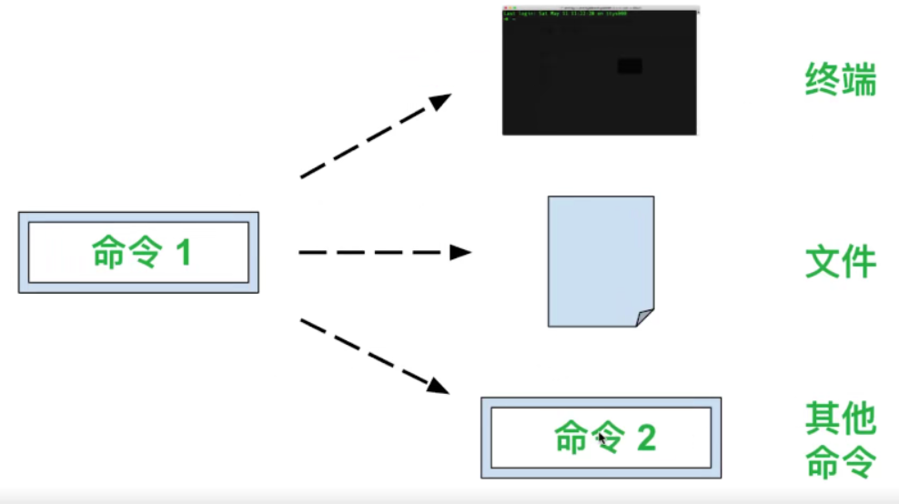
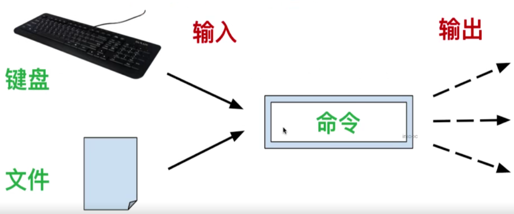
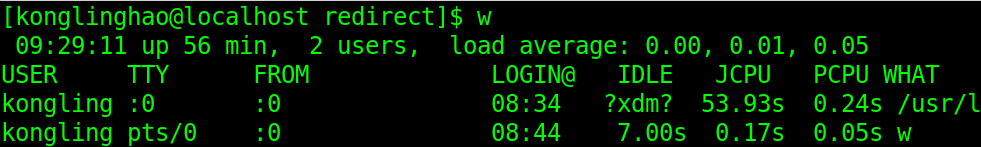
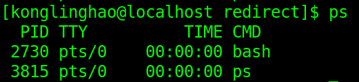
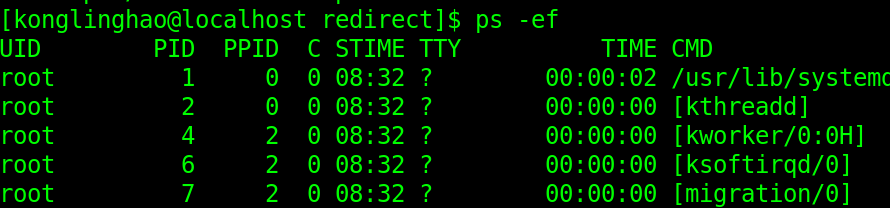
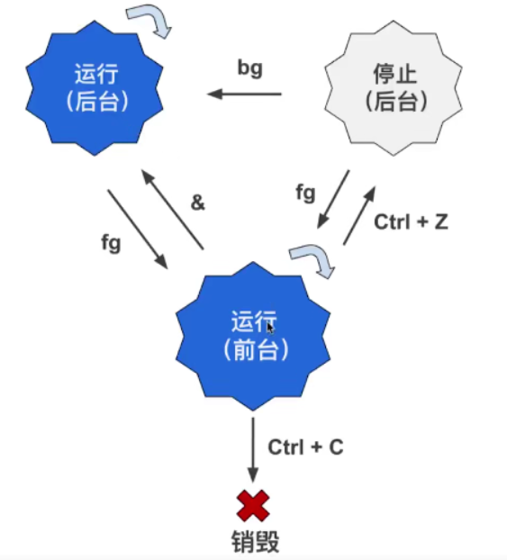

# 3、Linux进阶知识和命令

## 3-1 数据操作

### grep 命令

- **G**lobally search **R**egular **E**xpression and **P**rint ；全局搜索一个正则表达式，并且打印

**简单用法**

- grep text file
- text：代表要搜索的文本
- file：代表供搜索的文件

-i 参数：忽略大小写

- 默认的情况下，grep 命令是区分大小的
- grep -i path /etc/profile：找到 /etc/profile 文件内，包含了 path 的地方，且忽略大小写

-n 参数：显示行号

- grep -n path /etc/profile 

-v 参数：只显示文本不在的行

- invert（颠倒，倒置），-v 参数的作用就是只显示搜索的文本不在的那些行

-r 参数：在所有子目录和子文件中查找

**grep 的高级用法：配合正则表达式**

-E 参数：使用正则表达式

- E 是 extended regular expression（扩展的正则表达式） 的第一个字母
- grep -E Path /etc/profile
- grep -E ^path /etc/profile
- 在 CentOS 和 Ubuntu 这样的 Linux 发行版中，不加 -E 参数也是可以的，正则表达式始终是激活的

### rgrep 命令

- 作用相当于 **grep -r**

### egrep 命令

- 作用相当于 **grep -E**

### sort 命令

- 打印出文件中的内容，打印出的内容会进行排序然后显示出来
- sort name.txt：打印出 name.txt 中的排序后的内容

-o 参数

- output，将排序后的内容输出到新文件
- sort -o name_sorted.txt name.txt：将 name.txt 的内容排序后输出到 name_sorted.txt 中

-r 参数

- reverse ，倒序排列

-R 参数

- random，随机排列

-n 参数

- number，对数字进行从小到大排序，默认的，仅用 sort 命令的时候，是不区分字符是否是数字的，如果输入数字，那会按照字符串的排序方式一位一位比过来。

### wc 命令

- wc 是 word count 的缩写，可以用来统计行数，字符数，字节数等
- wc name.txt：输出的是： 9  9 50 name.txt，前三个数字的意思是：
- 行数（newline counts）
- 单词数（word counts）
- 字节数（byte counts）

-l 参数：

- line，统计行数

-w 参数：

- word，统计单词数

-c 参数：

- 这个缩写让人无法捉摸，统计字节数

-m 参数：

- 这个缩写也让人无法捉摸，统计字符数

### uniq 命令

- 删除文件中的重复内容（只能将连续的重复行合并）
- uniq repeat.txt：将 repeat.txt 的内容去重后打印（原文件中的内容不变）
- uniq repeat.txt unique.txt ：将 repeat.txt 的输出结果输出到 unique.txt 中

-c 参数：

- count，用于显示重复的行数
- uniq -c repeat.txt

-d 参数：

- duplicated，只显示重复的行的值
- uniq -d repeat.txt

### cut 命令

- 用于对文件的每一行进行剪切处理

-c 参数：

- charactor，根据字符数来剪切
- cut -c 2-4 name.txt：每一行只保留第2—第4个字符

### cut 命令进阶：根据分隔符来剪切

**CSV 格式**

- **C**omma **S**eparated **V**alues（逗号分隔值）
- CSV 文件的后缀名是 .csv，通常可以被 Excel 等软件打开

-d （delimiter 分隔符）参数：

- 指定用什么分隔符（逗号、顿号等）

-f （field 区域） 参数：

- 表示剪切下用分隔符分隔的哪一块或哪几块区域
- cut -d , -f 1 notes.csv：以逗号分隔，取第一部分
- cut -d , -f 1,3 notes.csv：以逗号分隔，取第一部分和第三部分
- cut -d , -f 1- notes.csv：以逗号分隔，取第一部分到最后的部分

## 3-2 输出重定向符号

### 管道

- pipeline；把两个命令连起来使用，一个命令的输出作为另一个命令的输入

### 流

- 在计算机科学中，流是时间上可用的一系列数据元素。我们可以把流比喻成传送带上的物件，每个时间点传输一个，而不是多个打包传输。

### 重定向

- 把本来要显示在终端的命令的结果，输送到别的地方；输送到文件中或者作为其它命令的输入（命令的链接，或者叫命令管道）
- 实现方法：通过在命令间插入特定的符号（“重定向流”符号）;
- 一个命令的输出去向有三个：终端，文件，其他命令，如下图所示：

### > 和 >>：重定向到文件

- 最简单的操作就是把命令的输出结果重定向到文件中，这样就不会在终端显示命令运行结果了

### >：重定向到新文件

- \>可以将命令的输出结果重定向到你选择的文件中
- cut -d , -f 1 notes.csv > students.txt：将 notes.csv 的内容裁剪后重定向到 students.csv 中，如果 students.csv 已经存在，那就会把文件内容覆盖掉

### “黑洞”文件  /dev/null

- /dev/null 文件是特殊文件，不是一个目录
- 此文件具有唯一的属性：它总是空的，它能使任何发送到 /dev/null 的任何数据作废

### >>：重定向到文件末尾

- 若没有文件则会新建，若已存在文件，那么会被追加到末尾。
- cut -d , -f 1 notes.csv >> students.txt：将 notes.csv 的内容裁剪后追加到 students.txt 的末尾

### stdin，stdout，stderr

- 从键盘向终端输入数据，这就是标准输入，也就是 stdin
- 终端接收键盘输入的命令，会产生两种输出：
- 标准输出：stdout。指终端输出的信息（不包括错误信息）
- 标准错误输出：stderr。终端输出的错误信息

### 文件描述符

- File Descriptor，简称 fd
- 文件描述符是一个用于表述指向文件的引用的抽象化概念；在形式上是一个非负整数。实际上它是一个索引值，指向操作系统内核为每一个进程所维护的该进程打开文件的记录表。当程序打开一个现有文件或者创建一个新文件时，内核向进程返回一个文件描述符。

| 文件描述符 | 名字   | 解释         |
| ---------- | ------ | ------------ |
| 0          | stdin  | 标准输入     |
| 1          | stdout | 标准输入     |
| 2          | stderr | 标准错误输出 |

### 2> 符号

- \>\>和\>只是把标准输出流重定向，并不会重定向标准错误输出。
- 标准错误输出的文件描述符是2，所以这里的2表示标准错误输出。

### 2>> 符号

- 用于将标准错误输出重定向到文件末尾

### 合并输出：2>&1

- 将标准错误输出重定向到与标准输出相同的地方
- cat not_exist_file.csv > results.txt **2>&1**
- 如果是追加 cat not_exist_file.csv >> results.txt **2>&1**

## 3-3 输入重定向符号

### <，<<：从文件或键盘读取 

- 不是所有的命令都有输入，也不是所有的命令都有输出
- 其实可以使命令的输入来自于文件或者键盘输入，如下图所示：

### <：从文件中读取

- \<符号用于指定命令的输入
- cat < notes.csv：运行结果和 cat notes.csv 一毛一样，但是中间的过程不同，< 表示的是直接将 csv 里面的内容作为输入然后打印出来，打开文件的工作交给系统去做；而没有 < 则表示打开文件，然后将里面的内容打印出来

### <<：从键盘读取

- << 符号的作用是将键盘的输入重定向为某个命令的输入
- sort -n << END：进入键盘输入模式，输入1，3，2以后再输入 END（刚刚定义了 END 为结束符），这样就会排序好然后输出。

## 3-4 管道符号

- |：作用是建立命令管道，一个命令的输出作为另一个命令的输入

例子：按学生名字排序并将其输出到 sorted_names.txt 文件中

- cut -d , -f 1 notes.csv | sort > sorted_names.txt

## 3-5 进程和系统监测

### Linux 是多任务多用户的操作系统

- Linux 可以管理多个同时运行的程序，是多任务
- Linux 也是一个多用户的系统，多个用户可以同时在不同地方通过网络连接到同一个 Linux 系统

### 多用户多任务的隐患

- 可能某个用户或者任务（其实就是运行着的程序），在某时让 Linux 系统过载了，这时候我们就想知道：哪个臭小子干了这事？

### w 命令

- w：可以帮助我们快速了解系统中目前有哪些系统登录着，以及它们在干什么

**运行时间（用 uptime 命令也可以做到）**

- **up 56 min**：系统已经正常运行了 56 分钟，重启之后时间会清零。

**负载（用 uptime 命令也可以做到）**

- **load average：0.00, 0.01, 0.05**：1分钟之内、5分钟之内、15分钟之内的平均负载分别为：0.00, 0.01, 0.05，一核的处理器数值超过1就是负载，二核的处理器数值超过2就是负载......
- tload 命令就会绘制随时间变化的负载曲线图

**登录的用户列表（用 who 命令也可以做到）**

- **USER**：用户名
- **TTY**：登录的终端名称
  - :0：实际上就是 tty1 的终端，就是我们图形界面的终端（有图形，不是黑框框）
  - pts：是 pseudo terminal slave 的缩写，表示 “伪终端从属”（就是我们在图形界面里面打开的黑框框）
- **FROM**：用户连接到的服务器的 IP 地址（或主机名）
- **LOGIN@**：用户登录的时间
- **IDLE**：用户有多久没活跃了（没运行任何命令）
- **JCPU**：该终端所有相关的进程使用的 CPU（处理器）时间，进程结束就会停止计时
- **PCPU**：表示 CPU 执行当前程序所消耗的时间
  - 当前进程就是在 **WHAT** 列里面显示的程序

### ps 命令和 top 命令

- 列出运行的进程；简单来说，进程就是加载到内存中运行的程序，大多数程序运行时都只在内存中启动一个进程

### ps 命令

- Process Status：进程的静态列表
- ps 命令显示的进程列表不会随时间而更新，是静态的，只是运行 ps 命令当时的那个状态

- PID（Process IDentifier）：进程号；每个进程有唯一的进程号
- TTY：进程运行所在的终端
- TIME：进程运行的时间
- CMD：产生这个进程的程序名
- **当 ps 命令不带参数的时候，只会显示当前运行 ps 命令的用户在当前终端所运行的进程**

ps -ef：列出所有进程

- UID：运行进程的用户
- PPID（Parent Process ID）：是程序的父进程号
  - 可以通过管道和 less 命令来方便查看：ps -ef | less

ps -efH：以乔木状列出所有进程

ps -u 用户名：列出此用户运行的进程

- ps -u konglinghao：列出 konglinghao 运行的进程

**ps -aux：通过 CPU 和内存使用来过滤进程**

- 根据 CPU 使用率来降序排列：**ps -aux --sort -pcpu | less**
- 根据内存使用率来降序排列：**ps -aux --sort -pmem | less**
- **ps -aux --sort -pcpu,+pmem | head**：将 CPU 和内存参数合并到一起，并通过管道显示前 10 个结果

### pstree 命令

- 以树形结构显示进程
- ps -axjf 和 pstree 效果比较类似

## 3-6 进程操作和系统重启

### top 命令

- 打印进程的动态列表；ps 命令虽然强大，但它是静态的。
- 这些进程是按照使用处理器的比率来排序的。

### 一些键盘的按键

- q：退出 top
- h：显示帮助文档，也就是哪些按键可以使用；按q 返回
- B：加粗，某些信息
- f / F：再进程列表中添加或删除某些列，按 q 回到 top 命令的主界面；默认情况下，是按照 %CPU 那一列来排序
- u：依照用户来过滤显示
- s：改变刷新的时间

### kill 命令

- 结束一个进程，后接需要结束的进程号，也就是之前我们看到过的 PID
- kill 8451 8561：用空格隔开进程号，结束好几个进程
- kill -9 7291：立即结束 PID 是7291的进程，非常“野蛮粗暴”

### killall 命令

- 结束所有的进程，后接程序名

### halt 命令

- 关闭系统，需要有 root 身份才能运行

### reboot 命令

- 重启系统，需要有 root 身份才能运行

### poweroff 命令

- 普通身份就能关闭系统

## 3-7 Linux 中5种常见的进程状态

- 运行（正在运行或在运行队列中等待），对应的状态码是 R（runnable）
- 中断（休眠中，受阻）；当某个条件形成后或接受到这个信号时，则脱离该状态，对应的状态码是 S（sleeping）
- 不可中断（进程不响应系统异步信号，即使用 kill 命令也不能使其中断），对应的状态码是 D（uninterruptible sleep）
- 僵死（进程已终止，但进程描述符依然存在，直到父进程调用 wait4() 系统函数后将进程释放），对应的状态码是 Z（a defunct（“zombie”）process）
- 停止（进程收到 SIGSTOP，SIGSTP， SIGTIN， SIGTOU 等停止信号后停止运行），对应的状态码是 T（停止 traced or stopped）

## 3-8 管理前后台进程

### & 符号和 nohup 命令：后台运行进程

- 可以在同一终端中同时运行好几个命令

### 前台进程和后台进程

- 默认情况下，用户创建的进程都是前台进程，前台进程从键盘读取数据，并把处理结果输出到显示器
- 后台进程与键盘没有必然的联系，当然，后台进程也可能会等待键盘的输入；后台进程的优点是不必等待程序运行结束，就可以输入其他命令

### & 符号：在后台运行进程

- 让一个进程在后台运行有几种方法：
- 第一种：在要运行的命令最后加上 & 这个符号：cp file.txt file_copy.txt &

### nohup 命令：使进程与终端分离

- &符号虽然常用，但是有一个不可忽视的缺点，那就是后台进程与终端相关联（就是终端关掉，或者用户登出，进程也就结束了）
- 当用户注销（logout）或者网络断开时，终端会收到 HUP（hangup 的缩写，“挂断”的意思）信号从而关闭其所有子进程；终端关闭时也会关闭其子进程
- 可以用 nohup 命令使命令不受 HUP 信号影响
- 用法：nohup cp file.txt file_copy.txt；一般来说也可以与 & 符号一起使用

### Ctrl + Z，jobs，bg 和  fg 命令：控制进程的前后台切换

- Ctrl + Z：转到后台，并暂停运行。
- bg （background）命令：将命令转入后台运行，假如命令已经在后台，并且暂停着（就是运行了 Ctrl + Z 之后），那么 bg 命令会让其开始运行；如果不加任何参数，bg 命令会默认作用于最近的一个后台进程（就是运行了 Ctrl + Z 之后的进程）
  - 如果后面加 %1，%2这样的参数（不带%，直接用1，2也可以），则会作用于指定标号的进程；进程转入后台之后，会显示它在当前终端下的后台进程编号
- jobs 命令：显示后台进程状态
- fg 命令：foreground，使进程转到前台，用法与 bg 类似

如果你原本想要使一个命令运行在后台，成为后台进程，但是忘记加 & 符号了，那么可以按照下面的顺序使此进程转为后台运行：

- Ctrl + Z：使进程转为后台暂停
- bg：使进程转为后台运行
- 为什么不直接用 bg 命令一步到位呢？因为如果不先用 Ctrl + Z 将此进程暂停，此进程就一直在前台运行，你没法在命令提示符后面输入

## 3-9 任务的定时和延时执行

### date 命令：调节时间输出

- date "+%H"：输出小时数
- date "+%H:%M:%S"

**用 date 修改系统时间**

- date 命令还可以修改系统时间，需要 root 身份
- sudo date 10121430：输出2020年**10月12日14时30分**，年份和秒数没有指定，因此不变

### at 命令：延时执行一个程序

- 可以用 at 命令设定命令执行的时间（到了时间以后只会执行**一次**）

**在指定时刻执行程序**

- 在这种用法下，at 命令的使用顺序如下：
- 先用 at 命令后接想要程序执行的确定时刻，然后按回车
- 再输入你想要在以上指定时刻执行的命令
  - at 22:10；
  - ls
  - 在22：10的时候执行 ls 命令
- 可以使用 Ctrl + D 组合键来结束输入并退出 at 命令；此时 at 会显示 \<EOT\>，是“End Of Transmission”（传输结束）
  - at 22:10 tomorrow：在明天的 22：10 执行
  - at 22:10 12/10/20：在 2020年12月10日 的 22点10分 执行

**在指定间隔之后执行程序**

- at now +10 minutes：在十分钟之后去执行
- 除了 minutes 以外还可以加：
  - hours：小时
  - days：天
  - weeks：星期
  - mouths：月
  - years：年

### atq 和 atrm 命令：列出和删除正在等待执行的 at 任务

**atq命令**

- queue，atq 会列出 at 命令的任务队列

**atrm命令** 

- remove，atrm 命令后接 at 任务的编号，例如 1，2，3，4...

### sleep 命令：休息一会儿

- 可以用分号隔开多个命令，使之一个接一个执行，这跟管道不同（管道是前一个命令的输出作为后一个命令的输入）
- touch file.txt;rm file.txt：创建 file.txt 文件，然后再删除它
- touch file.txt;**sleep 10**;rm file.txt：创建 file.txt 文件，休息**10秒**以后再删除 file.txt 文件 
- touch file.txt;**sleep 10m**;rmfile.txt：创建 file.txt 文件，休息**10分钟**以后再删除 file.txt 文件 

### && 和 || 符号

- &&：&& 号前的命令成功，才会执行后面的命令
- ||：|| 号前的命令失败，才会执行后面的命令
- 分号：不论成功失败，都会执行后面的命令

### crontab 命令：定时执行程序

- crontab 其实是一个命令，用来读取和修改名为 crontab 的文件，crontab 文件包含了你要定时执行的程序列表，也包含了执行的时刻；
- 实际上，有两个命令：crontab 和 cron；
  - crontab：用于修改 crontab 文件
  - cron：用于实际执行定时的程序
  - cron 这个单词来自于希腊语，原意是“时间”
- at 命令只能执行某个（或某几个）命令一次，但 crontab 可以重复执行命令
- **安装 crontab**：一般来说，CentOS 是默认安装了 crontab 程序
- 将 nano 当成默认的文本编辑器：
  - echo "export EDITOR=nano" >> ~/.bashrc
  - 运行 source ~/.bashrc 让其立即生效

**crontab 的三个主要参数**

- -l：显示 crontab 文件
- -e：修改 crontab 文件
  - crontab -e：如果上面配置了 .bashrc，那么它会默认用 nano 来打开 crontab 文件
- -r：删除 crontab 文件

**修改 crontab 文件**

- 每行指令的书写格式：**m h dom mon dow command **
- m：minute（0~59）
- h：hour（0~23）
- dom： day of month（1~31）
- mon：month（1~12）
- dow：day of week（0~6，星期日是0）
- command：用于定时执行的命令（涉及到路径的时候最好用绝对路径）
- 例子：
  - 10 22 * * * touch ~/file.txt：每天都在 10：22 的时候在家目录创建 file.txt 文件

| Crontab                | 意义                                                         |
| ---------------------- | ------------------------------------------------------------ |
| 47 * * * * command     | 每小时的 47 分都会执行 command 命令                          |
| 0 0 * * 1 command      | 每个星期一的凌晨都会执行 command 命令                        |
| 30 5 1-15 * * command  | 每个月的 1~15 日的 5 点 30 分都会执行 command 命令           |
| 0 0 * * 1,3,4 command  | 每个星期 1，3，4 的凌晨都会执行 command 命令                 |
| 0 */2 * * * command    | 每 2 个小时的整点（0，2，4，6，等）都会执行 command 命令     |
| */10 * * * 1-5 command | 每个星期1~星期5的每个 10 的倍数的分钟（0，10，20，30，等）都会执行 command 命令 |

**删除 crontab 文件**

- crontab -r：用于删除 crontab 文件

## 3-10 文件的解压和压缩

-  Linux 下常用的压缩解压软件
  - 一次只能压缩一个文件：gzip，bzip2 等
  - 一次能压缩多个文件：tar

### 打包和压缩

- **打包**是将多个文件变成一个总的文件，这个总的文件我们通常称为 **archive（存档，归档）**
- **压缩**是将一个大文件通过某些压缩算法变成一个小文件

### tar  命令，gzip 和 bzip2 命令的使用

- 首先，用 tar 将多个文件归档为一个总的文件，称为 archive
- 然后，用 gzip 或 bzip2 命令将 archive 压缩为更小的文件

### 将多个文件合并为一个文件

-cvf：创建一个 tar 归档

- tar -cvf sorting.tar sorting/：将 sorting 这个目录归档为 sorting.tar
  - c：create
  - v：verbose（冗余），会显示操作细节
  - f：file，指定归档文件
- 也可以直接对文件进行归档操作，不需要先把所有文件放到一个目录里**（建议先放在目录里然后归档）**
  - tar -cvf archive.tar file1.txt file2.txt file3.txt：把 file1.txt，file2.txt，file3.txt 三个文件归档为 archive.tar

-tf：显示归档里的内容，并不解开归档

- tar -tf sorting.tar：显示 sorting.tar 这个归档里的内容

-rvf：追加文件到归档

- tar -rvf archive.tar file_extra.txt：将 file_extra.txt 追加到 archive.tar 这个归档中

-xvf：解开归档

- 是 -cvf 的相反操作，将生成的归档解开
  - x：extract（提取）

### gzip 和 bzip2 命令：压缩归档

- gzip：比较常用
  - 用法：gzip sorting.tar
  - .tar.gz：用 gzip 命令压缩后的文件后缀名
- bzip2：不那么常用，压缩率比 gzip 更大，但是更耗时
  - 用法：bzip2 sorting.tar
  - .tar.bz2：用 bzip2 命令压缩后的文件后缀名

### gunzip 和 bunzip2 命令：解压

- gunzip sorting.tar.gz
- bunzip2 sorting.tar.bz2

### 用 tar 命令同时归档和压缩

-zcvf：归档，然后用 gzip 来压缩文档

- tar -zcvf sorting.tar.gz sorting：用 gzip 压缩，一步到位
- tar -zxvf sorting.tar.gz：解压

-jcvf：归档，然后用 bzip2 来压缩文档

- tar -jcvf sorting.tar.gz sorting：用 bzip2 压缩，一步到位
- tar -jxvf sorting.tar.gz：解压

### zcat/bzcat，zmore/bzmore，zless/bzless 显示用 gzip/bzip2 压缩的文件的内容

- 用法：zcat sorting.tar.gz

### zip/unzip 和 rar / unrar 命令：压缩 / 解压 zip 和 rar 文件

zip / unzip

- centos 里面是默认安装的，需要安装的话，方法如下：
- sudo yum install unzip：Red Hat 一族中的安装方式
- unzip archive.zip：解压 .zip 文件
- unzip -l archive.zip：不解开 .zip 文件，只看其中的内容
- zip -r sorting.zip sorting：生成 zip 压缩文件，-r 参数是递归压缩（一定要加）

rar /unrar

- 安装比较麻烦，没有直接的 yum 的安装方法，只能用源码编译，看下面的源码编译安装

## 3-11 编译安装软件

### 编译安装的大致步骤：

- 1、下载源代码（一般以压缩文件的形式）
- 2、解压压缩包
- 3、配置
- 4、编译
- 5、安装

### 首先，尝试找安装包

- 这一部分涉及到的软件安装包等知识点是基于 Red Hat 一族的 Linux 发行版，其他不是 Red Hat 一族的 Linux 发行版，安装软件的方式大同小异
-  Windows 有 .exe 结尾的安装文件，linux 一般没有，因为它有太多变数：

**Linux 系统有太多变数**

- Linux 存在极为多样的发行版（CentOS，Fedora，Ubunto，SUSE 等等）
- 每个发行版又有不同版本号
- 有不同的处理器种类（32位的和64位的 CPU。ARM 架构，Intel 架构等等）要适配
- 因此要为每种 Linux 创建一个安装文件几乎成了不可能的事情

当我们要找的文件不在 CentOS 的软件仓库中时，可以试试去软件的官方网站找后缀是 .rpm（Redhat Package Manager） 的安装包。

- .rpm 的安装包用于 Red Hat 一族的操作系统
- .deb 的安装包用于 Debian 一族的操作系统 

**alien 软件**

- 可以将 deb 安装包和 rpm 安装包互相转换
- alien 默认没有安装，所以要安装它：sudo yum install alien
- sudo alien -r xxx.deb：将 deb 转换为 rpm
- **注意：**用 alien 转换成的 rpm 并不能保证 100 % 顺利安装，能找到 rpm 安装包的话最好直接用 rpm

**安装 rpm 安装包**

- sudo rpm -i xxx.rpm

### 如果实在找不到 rpm 安装包

- 获取软件的源代码
- 自行编译

### 编译安装

- 编译就是将程序源代码转换成可执行文件的过程 

例子（以安装 htop 为例）：

- 1、去软件的官网：hisham.hm/htop（这个网址好像不行了）
- 2、找到源码地址（下载 .tar.gz 的文件）
- 3、如果发现 .tar.gz 的所有者是 root，那么用 chown 命令来改变所有者
- 4、解压：tar -zxvf xxx.tar.gz
- 5、解压完了进入这个文件（我们对这个文件里的 **configure 文件**（就是为软件的编译做准备工作）比较感兴趣）
- 6、运行（可执行程序可以直接用 ./ 来运行）：./configure（如果没有库文件，那就安装就行了）
- 7、运行 Makefile 文件：make Makefile
- 8、如果上面的步骤都没有错误，那就可以安装了（运行 sudo make install）
- 9、最后就可以用这个命令了

例子（rar / unrar）：

- 1、  `wget https://www.rarlab.com/rar/rarlinux-x64-5.7.0.tar.gz`（wget 相当于一个下载器），运行完了以后就会多出一个压缩文件
- 2、用 tar -zxvf rarlinux-x64-5.7.0.tar.gz 来解压，解压了以后会有一个 rar 目录。
- 3、进入 rar 目录了以后，发现不需要自己再编译了，它已经提供了两个可执行文件 rar 和 unrar
- 4、运行 sudo make 就行了**（make 命令就是用来编译的）**（这个时候 usr/local/bin 目录下就有了这两个命令，因为这个 bin 在环境变量里面，所以全局都能用这两个命令）

### rar 压缩文件

- rar a sorting.rar sorting：压缩；这里面的 a 是 add 的意思

### unrar 解压文件

- unrar e sorting.rar：解压；e 是 extract 是提取的意思
- unrar l archive.rar：不解开 .rar 文件，只想看其中的内容