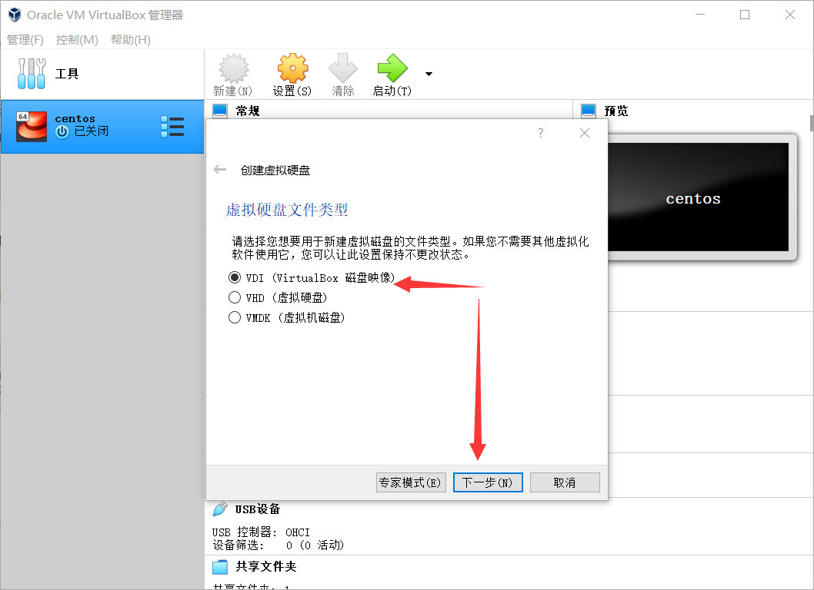
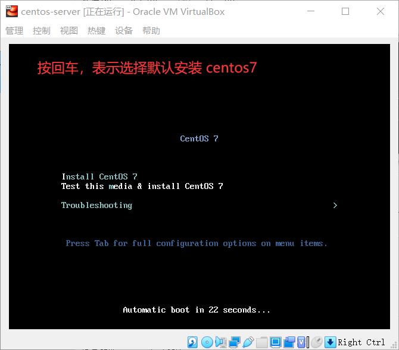
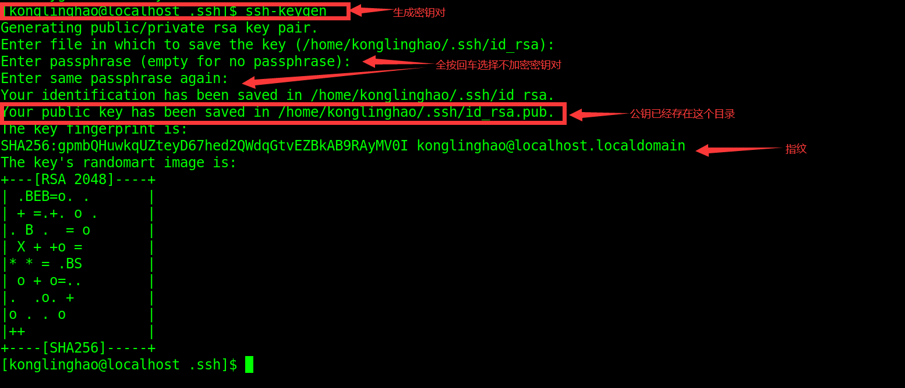

# 4、远程连接和SSH

## 4-1 安装 CentOS 服务器

 下载服务器版本的话，只需要下载[最小化的iso](http://mirrors.aliyun.com/centos/7.8.2003/isos/x86_64/)即可。minimal 没有图形化界面，就只有黑底白字的那种框框。








服务器版本的话我们只使用 root 用户去玩可能会方便一点，因为我们已经知道了Linux系统的权限的知识


## 4-2 CentOS 的基本配置

### 查看 IP 信息的两个命令

- ifconfig：比较旧的命令。net-tools 中的命令。
- ip addr：比较新的命令。iproute2 中的命令。

**我们通过 ip addr 可以看到内网的 ip；我们想把它改成局域网的 ip ：**

- 第一步：poweroff：关机
- 第二步：选中虚拟机—>设置—>网络—>连接方式—>**桥接网卡**—>ok（可以了解一下 [VirtualBox 中有4种网络连接方式](https://www.cnblogs.com/jpfss/p/8616613.html)）
- 第三步：启动

这样这个 ip 就可以当作我们主机来访问虚拟机的地址（局域网 ip 就是在同一个局域网下的设备都能去访问它）。

## 4-3 连接远程终端相关的知识

我们可以远程连接到 Linux ，可以从多种操作系统远程连接到 Linux 系统。

### 服务器

- server：一般是指 7 天 24 小时不关机的电脑
- 服务器也有一个处理器，一个或多个硬盘等等，它们的特色就是保持开机，始终连接 Internet 提供服务

### 客户机

- client：把连接到服务器的机器称为客户机

### 协议

- 两台机器在互联网上通信的时候，需要遵循相同的协议

### SSH 协议

- SSH 是英语 Secure SHell 的缩写，表示“安全的 Shell”

### Shell

- 在计算机科学中，shell 俗称 "壳"
- “壳” 用来区别于 “核”（kernel），一个是外壳，一个是核心
- shell 是指 “提供用户使用界面”的软件（命令解析器），它类似于 DOS 下的 command 和后来的 cmd.exe
- shell 接收用户命令，然后调用相应的程序
- Linux 下有 Bash 等 Shell 程序

## 4-4 对称加密和非对称加密，SSH 协议

从两条主线去了解 SSH 协议

- 有哪些不同的加密方法
- SSH 优势如何运用加密的方法来保护数据的

### 不同的加密方法

**对称加密**

- Symmetric-Key Encription
- 对称加密算法用**同一个密钥**来加密信息
- 传递密钥的时候可能被密钥可能被黑客截获
- 为了加密用于对称加密的密钥，将用另一种方法：**非对称加密**

**非对称加密**

- Asymmetric-Key Encription
- 非对称加密方法中，我们用一个密钥来进行加密，用另一个密钥来进行解密，两个密钥不一样，所以是“非对称”
  - 公钥（Public Key），用于加密
  - 私钥（Private Key），用于解密
- 公钥可以在网络上以明文传输，毕竟是公开的密钥，即使被黑客截获也无所谓；但用于解密的私钥却不能被公开传输

### 用 SSH 创建一个安全的通信管道

- SSH **结合使用** 非对称加密和对称加密两种方法
  - 首先，使用非对称加密，安全地传输**对称加密**的密钥
  - 之后，就一直使用**对称加密**的密钥来作为加密和解密的手段

### 用 SSH 进行连接

**两种情况：**

- 第一种情况：你已经租用了一台服务器，这台服务器因为已经配置好了作为 SSH 服务器，所以你什么也不用做。
- 第二种情况‘：你没有组用一台服务器，那么需要将自己的电脑配置成 SSH 的服务器

**配置 SSH 服务器：**

安装 openssh

- OpenSSH 是 SSH 协议的免费开源实现
- OpenSSH 分为客户端和服务端
  - 客户端：openssh-client
  - 服务端：openssh-server
- 以客户端的模式去使用 SSH（只是想用 SSH 远程连接到别的机器）：sudo yum install openssh-clients
- 以服务端的模式去使用 SSH（使自己的及其开放 SSH 服务）：sudo yum install openssh-server
  - 安装完成服务器端，它会自动开启 sshd 这个精灵进程（Deamon Process，或称为“守护进程”），是一种运行在后台的特殊进程
  - 也可以手动开启 sshd：sudo systemctl start sshd
  - 停止 sshd：sudo systemctl stop sshd
  - 重启 sshd：sudo systemctl restart sshd
  - 查看 sshd 状态：sudo systemctl status sshd
  - 将 sshd 设为开机自启动：sudo systemctl enable sshd

## 4-5 服务器安装 SSH 服务

- 安装 SSH：yum install openssh-server
- 启动 SSH：systemctl start（或 restart）sshd
- 设置开机运行 SSH：systemctl enable sshd
- 对于我们安装的 minimal 系统，他好像默认已经装好并启动好了（所以上面的流程知道就行）：


## 4-6 客户安装 SSH 工具

客户端可以用 3 种：

- **Windows 客户端**：安装 Putty、XShell 或 SecureCRT（我安装了 Putty）
- **Linux 客户端**：yum install openssh-clients
- **macOS 客户端**：默认已经安装好了 SSH 客户端

## 4-7 客户端通过 SSH 连接服务器

- 用 putty 来连接：


第一次连接的时候会出现这个问题，我选择的是 ”是“。


然后进入黑框框了之后登录 root 用户即可。

- 在 Linux 客户端中去连接我们的服务器：


- 在 mac 中使用（**我没有 mac！！**）

## 4-8 用 config 文件配置 SSH 

### config 配置文件

- config 是英语 configuration 的缩写，它可以配置 SSH，方便批量管理多个 SSH 连接

### 全局 config 文件

- 全局的 config 文件有两个：
  - SSH 客户端的配置：/etc/ssh/ssh_config
  - SSH 服务端的配置：/etc/ssh/ssh**d**_config
- 查看 config 文件的使用手册
  - SSH 服务端 config 文件的使用手册：**man sshd_config**
  - SSH 客户端 config 文件的使用手册：**man ssh_config**

### 客户端 config 文件的常用配置参数

| 客户端 config 参数 | 作用                     |
| ------------------ | ------------------------ |
| Host               | 别名                     |
| HostName           | 远程主机名（或 IP 地址） |
| Port               | 连接到远程主机的端口     |
| User               | 用户名                   |

例子（**客户端的配置文件**，一般很少去修改，一般去修改的都是全局的服务端的配置文件）：

```
Host linghao
	HostName 192.168.1.105
	Port 22
	User root
```

### 服务端 config 文件的常用配置参数

| 服务端 config 参数     | 作用                                       |
| ---------------------- | ------------------------------------------ |
| Port                   | sshd 服务端口号（默认是 22）               |
| PermitRootLogin        | 是否允许以 root 用户身份登录（默认是可以） |
| PasswordAuthentication | 是否允许密码验证登录（默认是可以）         |
| PubkeyAuthentication   | 是否允许公钥验证登录（默认是可以）         |
| PermitEmptyPasswords   | 是否允许空密码登录（不安全。默认是不可以） |

- 修改了全局的 config 文件后，重启 sshd 服务使之立即生效（systemctl restart sshd）

### 局部的 config 文件

- 局部的 config 文件只有客户端有（在 ~/.ssh/config）
- 一般来说是没有这个文件的，我们需要手动创建  ~/.ssh/config
- 一般会把  ~/.ssh/config 的权限修改为 600：chmod 600 ~/.ssh/config


**如果在 root 用户的家目录下如果没有 .ssh 目录**

- 使用这个命令来登录，来生成 .ssh 目录：ssh loaclhost

## 4-9 SSH 免密码登录

### SSH 的两种安全验证方法

- 基于口令
- 基于密钥

### 基于口令的验证

- 用账户和密码来验证登录

### 基于密钥的验证

- 客户机生成密钥对（公钥和私钥），把公钥上传到服务器
- 并与服务器的公钥进行比较
- 这种方法更加安全，也被称为”公钥验证登录“
- 过程：
  - 将公钥传给服务器
  - 下一次请求连接时，服务器用公钥加密一串字符串返回
  - 客户端用私钥解密出来字符串，然后把字符串发回给服务器
  - 服务器验证，验证通过就允许连接

### 公钥验证登录

- 第一步：在客户机中生成密钥对（公钥和私钥）
  - 用命令：**ssh-keygen**（默认使用 RSA 非对称加密算法），这条命令等价于 **ssh-keygen -t rsa**
  - 在 ~/.ssh/ 目录下，会新生成两个文件：
    - **id_rsa.pub**：公钥
    - **id_ras**：私钥



- 第二步：把客户机的公钥传送到服务器
  - 用 **ssh-copy-id** 这个命令来传送，它把客户机的公钥追加到服务器的一个文件（**authorized_keys**，它在服务器端的 ~/.ssh/authorized_keys）
  - **ssh-copy-id root@192.168.1.105** ：它默认会把家目录下的 .pub 文件传送到我们的服务器


如果设置了免密登录了以后还想用密码登录，那么可以运行这一句：**ssh -o PreferredAuthentications=password -o PubkeyAuthentication=no root@192.168.1.105**
