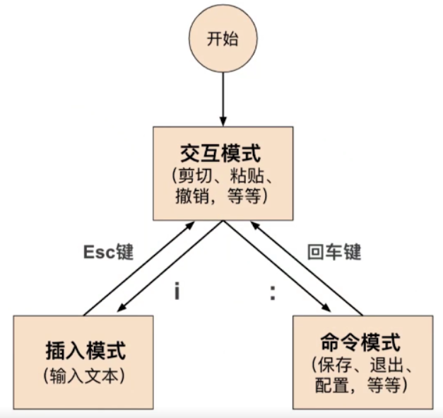

# 5、文本编辑与版本控制

## 5-1 高级文本编辑器，安装启动 Vim

两件文本编辑器的 “神器”：Vim 和 Emacs

### Vim

- Vi 文本编辑器的进阶版，是 Vi iMproved 的缩写，表示"改进了的 Vi"（在 Linux 中一般默认安装）

### Emacs

- 著名的开源先驱 Richard Stallman 开发的文本编辑器，后来有很多人参与改进 Emacs（在 Linux 默认没有安装）

### 安装 Vim

-  sudo yum install vim（大部分 Linux 发行版都是默认安装的，但是不排除少部分没安装）
- 安装完了以后输入 vim 就能启动 vim 文本编辑器

### vimtutor：vim 的教程程序

- vim 中内嵌了一个教程小程序
- 输入 vimtutor 就能执行

## 5-2  vim 的多种模式和基本操作

### vim 的多种模式

- 交互模式
- 插入模式
- 命令模式
- 可视模式（一般不太用）

### vim 的交互模式

- 交互模式：interactive mode；也称为正常模式（Normal Mode）
- 这是 vim 的默认模式。每次运行 vim 程序的时候，就会进入这个模式
- 在这个模式中，你不能输入文本
- 它可以让我们在文本间移动，删除一行文本，复制粘贴文本，跳转到指定行，撤销操作等等

### vim 的插入模式

- 插入模式：insert mode
- 就是我们平时可以打字的那种模式
- 进入这个模式有几种方法：
  - 按 i ：最常见的方法
  - 其他进入插入模式的方法：I（大写的 i）、a 和 A、o 和 O
- 退出这种模式，只需要按下 ESC（escape） 键

### vim 的命令模式

- 命令（行）模式：Command Mode 或 Command-Line Mode；也可以称为底线命令模式（Last line mode）
- 在这个模式下可以运行一些命令例如“退出”、“保存”等等
- 也可以用这个模式来激活一些 vim 的配置，例如语法高亮，显示行号等等
- 也可以发送一些命令给终端命令行，例如 ls、cp 等等
- 为了进入这个模式下，我们首先需要处于交互模式下，然后按 :（冒号）键，输入命令然后再按回车，就会执行此命令；执行了命令以后就会又回到交互模式了（当然了，你冒号打到一半，直接按 ESC 也可以回到交互模式）

### 图形界面的 vim：gVim

- vim 也有一个图形界面的版本，称为gVim（Gnome Vim 的缩写）
- gVim 的功能和 vim 是基本一样的
- gVim 也有 windows 版本

### 基本操作（移动，写入，保存，等等）

**打开 vim**

- 在终端直接输入 vim 就可以运行起来
- 也可以用 vim 来打开一个文件，只需要在 vim 后面再加文件名
- **vim 文件名**：如果文件不存在，那么就会被创建

**移动：h，j，k，l（上下左右移动）**

- 在 vim 的交互模式下，我们可以在文本中移动光标（用方向是一样的）

| 按键 | 作用             |
| ---- | ---------------- |
| h    | 向左移动一个字符 |
| j    | 向下移动一个字符 |
| k    | 向上移动一个字符 |
| l    | 向右移动一个字符 |

**0：移动到行首**

- 在交互模式下，数字 0 可以将光标定位到一行的开始位置（跟 home 键一样）

**$：移动到行末**

- 在交互模式下，$ 可以将光标定位到一行的行末（跟 End 键一样）

**w：一个单词一个单词移动**

- 在交互模式下，按 w 可以一个单词一个单词移动

**:w 保存文件**

- 在交互模式下，按下冒号键（:），可以进入命令模式
- 再按下 w（w 是 write 的首字母，是英语 "写入" 的意思）
- :w myfile：写入文件，文件取名为 myfile

**:q 退出**

- 在交互模式中，先按下冒号键以进入命令模式，再按下 q 键

**:q! 强制退出**

- 在交互模式中，先按下冒号键以进入命令模式，再按下 q! 键，没保存就可以直接退出了

**:wq 保存然后退出**

- 两个命令的组合：w 和 q

**:x 保存然后退出**

- 和 :wq 的效果一样

## 5-3 vim 的标准和高级操作

### 标准操作（复制，粘贴，撤销，等等）

