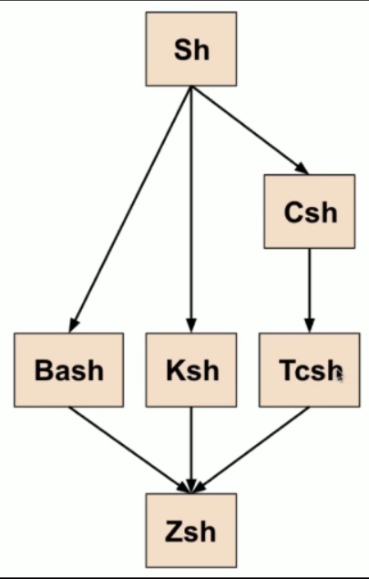
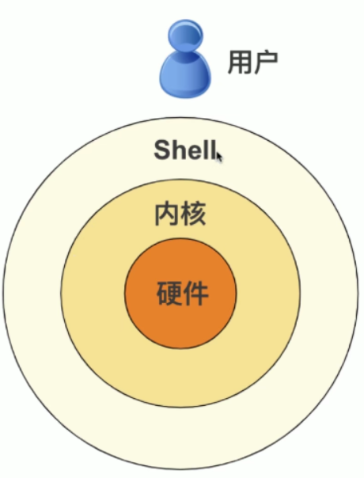

# 7、shell 脚本编程

## 7-1 来玩 shell 吧 ^_^

### 什么是 shell

- 有点像嵌入在 Linux 这样的操作系统中的一个“微型编程语言”；shell 不像 c 语言、c++、java 等语言那么完整，但是它可以帮我们完成很多自动化任务，例如：保存数据，监测系统的负载，等等；shell 相比 c 等语言的优势在于它是完全嵌入在 Linux 中的，不需要安装，不需要编译。

### shell 脚本

- 脚本（script）是批处理文件的延伸，是一种纯文本保存的程序
- 计算机脚本程序是确定的一系列控制计算机进行运算操作动作的组合，在其中可以实现一定的逻辑分支等

### 关于不同的环境

- Linux 的图形界面环境有很多：GNOME，KDE，XFCE 等
- 中断命令环境其实也有很多（虽然看起来都是黑框框）：它对应的就是不同的 shell ，shell不同命令的功能可能也不一样

### 几种主流的 shell

- Sh：Bourne Shell，是目前所有 Shell 的祖先
- Bash：Bourne Again Shell，是 Sh 的一个进阶版本，是目前大多数 Linux 发行版和 macOS 操作系统的默认 shell
- Ksh：Korn Shell，在收费的 Unix 版本上比较多见
- Csh：C Shell，此 Shell 语法有点类似 C 语言
- Tsh：Tenex C Shell，Csh 的优化版本
- Zsh：Z Shell，比较新的一个 Shell，集 Bash，Ksh 和 Tcsh 各家之大成



### shell 可以干啥捏？

- shell 是管理命令行的程序；其实是 shell 这个程序在等待你输入那些命令
- 记住你在终端输入过的命令（向上键）
- 控制进程
- 重定向命令（用到 <，>，|，等符号）



### 以 rc 结尾的文件

- .bashrc，.zshrc，.init.rc，.vimrc，等等；
- 一般以 rc 结尾的多为配置文件，里面包含了软件运行前会去读取并运行的那些初始化命令

### 安装 shell

- 安装 zsh：**sudo yum install zsh**

### 切换 shell

- **chsh**（Change Shell）：切换 shell

### 为什么切换 shell 很重要？

- shell 脚本需要依赖于某一个 shell，在使用不同的 shell（Sh，Bash，Zsh，Ksh，等等）的时候，语法其实是不一样的。下面来学 Bash 上的 shell 脚本编写。

## 7-2 第一个 shell 脚本

### 创建脚本文件

- **vim test.sh**
- 实际上 shell 和普通的文本文件没啥区别，只是后缀名 .sh 已经称为一种约定俗称的命名管理

### 指定脚本要使用的 shell

- 在写一个 shell 脚本的时候，第一要做的事情就是指定要使用哪种 shell 来 “解析/运行” 它，因为不同的 shell 语法不一样。

```shell
#!/bin/bash
```

- #！被称为 Sha-bang（或者 Shebang）；当第一行都头两个字母出现 #! 的时候，类 unix 操作系统的载入器会分析 #! 后面的内容，将这些内容作为解释器指令并调用该指令，并将载有 #! 的文档路径作为该解释器的参数。比如上面的那行，它并不是必不可少的，但是它确保会用 /bin/bash 来解析后面要写的命令（也就是说被指定的 shell 执行）。

### 运行命令

- 原则很简单：只需要写入你想要执行的命令就行了。

### 注释

- 注释是不会被执行的行，但是可以用于解释我们的脚本做了什么，Shell 脚本的注释以 #（井号）开头

```shell
#!/bin/bash

# 列出目录的文件
ls
```

### 给脚本文件添加可执行的权限

- 加上可执行权限：**chmod +x test.sh**

### 运行脚本

- 运行脚本文件：**./test.sh**

### 以调试模式运行

- 调试一个脚本程序：bash -x test.sh
- -x 参数：表示以调试模式运行
- 以调试模式运行的时候 shell 就会把我们的脚本文件运行时的细节打印出来了

### 创建属于自己的命令

我们只能 ./test.sh 的形式运行 shell 脚本，而且还得在正确的目录，这太麻烦了；我们之前的命令例如：ls，cp 等，它们是存在 **PATH 环境变量**里面的。

### PATH 环境变量

- PATH 是 Linux 的一个系统环境变量，这个变量包含了你系统里所有可以被直接执行的程序的路径。
- 打印输出 PATH 变量的值：echo $PATH；每个路径之间用冒号来分割；因此只用把 `test.sh` 文件拷贝到上述文件的任意一个目录当中，这样就能够随便在哪里运行 `test.sh` 这个脚本了，前面就不需要加上 `./ `了

```
/usr/local/bin:/usr/local/sbin:/usr/bin:/usr/sbin:/bin:/sbin:/home/konglinghao/.local/bin:/home/konglinghao/bin
```

- 我们将目录拷贝到 `/usr/bin` 目录中：**sudo cp test.sh /usr/bin**

## 7-3 shell 的变量

### 定义变量

- message='hello world'**（要注意等号的两边不要加空格！）**
- message：变量名
- 'hello world'：变量值

### echo：显示内容

-  作用是在终端上显示传入的信息
- **echo hello world**：在终端里打印出 hello world
- 如果要插入换行符（\n），那么需要用到 **-e 参数**，这是为了使 "转义字符" 发生作用（不然即使有转义字符也木有用）
- 在 bash 脚本中，如果要显示一个变量，用 echo 后接变量名还不够，需要在变量名前加上美元符号（$）

```shell
#!/bin/bash

message='hello world'
echo $message
```

### 引号

- 可以用引号来界定包含空格的字符串

| 类型   | 表示 |
| ------ | ---- |
| 单引号 | '    |
| 双引号 | "    |
| 反引号 | `    |

单引号：

- 如果变量被包含在单引号里面，那么变量就不会被解析，美元符号（$）保持原样输出
- 单引号忽略被它括起来的所有特殊字符

双引号

- 双引号会忽略大多数特殊字符，但不包括：美元符号（$）、反引号（`）、反斜杠（\）
- 不忽略美元符号意味着 shell 在双引号内部可以进行变量名替换

反引号

- 反引号要求 shell 执行被它括起来的内容

```shell
#!/bin/bash

message=`pwd`
echo "you are in the directory $message"

# 最后执行这个 shell 脚本，会显示出：you are in the directory /home/konglinghao
```

### read：请求输入

- read 命令读取到的文本会立刻被存储在一个变量里

```shell
#!/bin/bash

read name
echo "hello $name"

# 最后运行这个脚本的时候会让你输入，然后按回车，这样你输入的值就会赋值给 name
```

**同时给多个变量赋值**

```shell
#!/bin/bash

read firstname lastname
echo "hello $firstname $lastname"

# 最后运行的时候输入：linghao kong ；输出就是 hello linghao kong
```

- 可以用 read 命令一次性给多个变量赋值，read 命令一个单词一个单词（用空格隔开）地读取你输入地参数，并且把每个参数赋值给对应变量

**-p：显示提示信息**

- read 命令地 -p 参数，p 是 prompt（提示） 的首字母

```shell
#!/bin/bash

read -p 'Please enter your name：' name
echo "hello $name"

# 这个时候让你打印前会有一行提示信息"Please enter your name："来提示你打印
```

**-n：限制字符数目**

- 用 -n 参数可以限制用户输入的字符串的最大长度（字符数）

```shell
#!/bin/bash

read -p 'Please enter your name：' -n 5 name
echo "hello $name"

# 这个时候长度就会被限制为 5 
```

**-t：限制输入时间**

- 限定用户输入的时间（以秒为单位），超过这个时间，就不读取输入了

**-s（secret）：隐藏输入内容**

- 用 -s 参数可以隐藏输入内容，如果你想用户输入的是一个密码，可以用一波

### 数学运算

**牢记！在 bash 中，所有的变量都是字符串！**

**let 命令**

- bash 本身不会操纵数字，因此它也不会做运算；但是可以用 **let 命令**来达到这个目的

```shell
#!/bin/bash

let "a = 5"
let "b = 2"
let "c = a + b"

echo "c = $c" # 此时 c 打印出来的就是 7
```

**bs 命令**

- 如果要做带小数的运算，那么需要用到 bc 的命令

### 环境变量

- shell 的环境变量可以被此种 shell 的任意脚本程序使用，有时也把环境变量称为“全局变量”
- 可以用 **env 命令**来显示你所有的环境变量
- **SHELL**：指明目前你使用的是哪种 shell
- **PATH**：是一系列路径的集合，只要有可执行程序位于任意一个存在于 PATH 中的路径，那就可以直接输入可执行程序的名字来执行

```shell
#!/bin/bash

# 使用全局变量
echo "Your default shell is $SHELL, and your path is $PATH"
```

设置环境变量

- 可以用 **export** 关键字来设置环境变量

### 参数变量

- 可以这样调用我们的脚本文件：./variable.sh 参数1 参数2 参数3 ...
- 上面的 参数1， 参数2， 参数3 等等就被称为“参数变量”

| 变量 | 含义               |
| ---- | ------------------ |
| $#   | 参数的数目         |
| $0   | 被运行的脚本的名称 |
| $1   | 第 1 个参数        |
| $2   | 第 2 个参数        |
| $N   | 第 N 个参数        |

```shell
#!/bin/bash

echo "You have executed $0，there are $# parameters"
echo "The first parameter is $1"

# 在运行的时候：./variable.sh parameter1 parameter2 parameter3
# 输出：You have excuted ./variable.sh, there are 3 parameters
# 	   The first parameter is parameter1
```

- 可以用 shift 命令来"挪移"参数，以便依次处理，此命令常被用在**循环中**

```shell
#!/bin/bash

echo "The first parameter is $1"
shift
echo "The first parameter is now $1"

# 在运行的时候：./variable.sh parameter1 parameter2 parameter3
# 输出：The first parameter is parameter1
# 	   The first parameter is now parameter2
```

### 数组

```shell
#!/bin/bash

array=('value1' 'value2' 'value3' 'value3' )
array[5]='value5'
echo ${array[1]} # 这是数组的用法
echo ${array[*]} # 打印出数组中所有的数
```

- 数组可以包含任意大小的元素数目
- 数组的元素编号不需要是连续的

## 7-4 shell 的条件

### if 

```shell
# 基本格式：
if [ 条件测试 ] # 注意，条件测试的两边都必须要空一格
then
	做这个
fi # 表示 if 语句结束
```

- 在 shell 语言中，“等于” 是用一个等号（=）来表示的（其实用两个等号也 ok 的 ^_^）

```shell
#!/bin/bash

name="konglinghao"

if [ $name = "konglinghao" ]
then
	echo "hello $name"
fi
```

- 条件不成立用 else

```shell
# 基本格式：
if [ 条件测试 ]
then
	做这个
else 
	做那个
fi
```

```shell
#!/bin/bash

name1="kong"
name2="linghao"

if [ $name1 = $name2 ]
then 
	echo "You two have the same name!"
else
	echo "You two have different names!"
fi
```

- elif：否则如果

```shell
# 基本格式
if [ 条件测试1 ]
then
	做事情1
elif [ 条件测试2 ]
then
	做事情2
elif [ 条件测试3 ]
then
	做事情3
else
	做其他事情
fi
```

### 条件测试

- 测试类型：
  - 测试字符串
  - 测试数字
  - 测试文件

**测试字符串**

| 条件                 | 意义                                                       |
| -------------------- | ---------------------------------------------------------- |
| $string1 = $string2  | 两个字符是否相等。shell 大小写敏感，因此 A 和 a 是不一样的 |
| $string1 != $string2 | 两个字符串是否不同                                         |
| -z $string           | 字符串 string 是否为空（zero）                             |
| -n $string           | 字符串 string 是否为不空（not）                            |

**测试数字**

| 条件            | 意义                          |
| --------------- | ----------------------------- |
| $num1 -eq $num2 | 两个数字是否相等              |
| $num1 -ne $num2 | 两个数字是否不同              |
| $num1 -lt $num2 | 数字 num1 是否小于 num2       |
| $num1 -le $num2 | 数字 num1 是否小于或等于 num2 |
| $num1 -gt $num2 | 数字 num1 是否大于 num2       |
| $num1 -ge $num2 | 数字 num1 是否大于或等于 num2 |

**测试文件**

| 条件              | 意义                                     |
| ----------------- | ---------------------------------------- |
| -e $file          | exist；文件是否存在                      |
| -d $file          | directory；文件是否是一个目录            |
| -f $file          | file 文件是否是要给文件                  |
| -L $file          | link；文件是否是一个符号链接文件         |
| -r $file          | readable；文件是否可读                   |
| -w $file          | writable；文件是否可写                   |
| -x $file          | executable；文件是否可执行               |
| $file1 -nt $file2 | newer than；文件 file1 是否比 file2 更新 |
| $file1 -ot $file2 | older than；文件 file1 是否比 file2 更旧 |

**测试多个条件**

| 符号 | 意义 |
| ---- | ---- |
| &&   | 与   |
| \|\| | 或   |

```shell
#!/bin/bash
# 注意一下 && 写的位置
if [ $# -ge 1 ] && [ $1 = 'love' ]
then
	echo "great !"
	echo "you know the password"
else
	echo "you do not know the password"
fi
```

### case：测试多个条件

```shell
#!/bin/bash

case $1 in
	"Matthew")
		echo "hello Matthew!"
		;;
	"Mark")
		echo "hello Mark"
		;;
	"Luke")
		echo "hello Luke"
		;;
	"John")
		echo "hello John"
		;;
	*)
		echo "sorry, I do not know you"
		;;
esac
```

- 也可以在 case 中做或的判断，但不是用两根竖线（||），而是一根竖线（|）

```shell
#!/bin/bash

case $1 in
	"dog" | "cat" | "pig")
		echo "it is a mammal"
		;;
	"pigeon" | "swallow")
		echo "it is a bird"
		;;
	*)
		echo "I do not know what it is"
		;;
esac
```

## 7-5 shell 的循环语句

主要的循环语句有三种：

- while 循环
- until 循环
- for 循环

### while 循环

```shell
# while 循环的逻辑
while [ 条件测试 ]
do 
	做某些事
done
```

```shell
#!/bin/bash

while [ -z $response] || [ $response != 'yes' ]
do 
	read -p 'say yes: ' response
done
```

### until 循环

- 和 while 正好相反

```shell
#!/bin/bash
until [ "$response" = 'yes' ]
do
	read -p 'say yes：' response
done
```

### for 循环

```shell
# for 循环的基本逻辑：遍历列表
for 变量 in '值1' '值2' ... '值n'
do 
	做某些事
done
```

```shell
#!/bin/bash

for animal in 'dog' 'cat' 'pig'
do
	echo "animal being analyzed：$animal"
done
```

```shell
#!/bin/bash

listfile=`ls` # 这里的 listfile 就等于 ls 命令运行的结果

for file in $listfile
do 
	echo "file found: $file"
done
```

### 更常规的 for 循环

- 可以借助 seq （sequence 序列）命令，来实现类似主流编程语言中的 for 循环的语法

```shell
#!/bin/bash

for i in `seq 1 10` # 这回返回 1~10 的数
do
	echo $i
done

for i in `seq 1 2 10` # 这回返回 1~10 之间的数，取值间隔为 2
do
	echo $i
done
```


## 7-6 shell 的函数

### 函数的定义

**定义（或创建）shell 函数的方式1**

- 函数名后面跟着的圆括号里**不加任何参数**
- 函数的完整定义必须置于函数的调用之前

```shell
函数名 () {
	函数体
}
```

```shell
#!/bin/bash

print_something () {
	echo "hello, I am a function"
}

print_something
print_something
```

**定义（或创建）shell 函数的方式2**

```shell
function 函数名 {
	函数体
}
```

### 传递参数

```shell
#!/bin/bash
# shell 的函数参数放在执行的时候传递，函数体里用 $1 等来用就是了
print_something () {
	echo hello $1
}

print_something Matthew
print_something Mark
print_something Luke

```

### 返回值

- shell 函数没办法做到返回值，但是可以返回一个**状态**
- shell 函数返回状态也用 return 这个关键字

```shell
#!/bin/bash
print_something () {
	echo hello $1
	return 1
}

print_something luke
print_something johe
echo return value of previous function is $? # $? 返回前一个函数运行完后的状态（1）
```

如果想要函数返回一个计算的值

```shell
#!/bin/bash
lines_in_file () {
	cat $1 | wc -l # 利用管道，用 wc 来统计行数，行数会被打印出来
}

line_num=$(lines_in_file $1)

echo the file $1 has $line_num lines

```

### 变量的作用范围

- 默认来说，一个变量是“全局的”
- 要定义一个局部变量，需要用 local 关键字

```shell
#!/bin/bash

local_global () {
	local var1='local 1'
	echo Inside function: var1 is $var1 ; var2 is $var2
	var1='changed again' # 这里的 var1 是函数中定义的局部变量
	var2='2 changed again' # 这里的 var2 是函数外定义的全局变量
}
var1='global1'
var2='global2'
echo Before function call: var1 is $var1 ；var2 is $var2
local_global
echo After function call：var1 is $var1 ；var2 is $var2

# 运行的结果：
# Before function call: var1 is global1 ；var2 is global2
# Inside function: var1 is local 1 ; var2 is global2
# After function call：var1 is global1 ；var2 is 2 changed again
```

### 重载命令

- 可以用函数来实现命令的重载，也就是说把函数的名字取成与我们通常在命令行用的命令相同的名字
- 重载命令的关键字：**command**

```shell
#!/bin/bash

ls () {
	command ls -lh # 如果没有 command，那就会无限循环
}

ls
```

### 函数的设计

- 单一职责，别让一个函数干太多工作


## 7-7 shell 实现图片展示网页

### 实现的项目

- 创建一个网页，这个网页展示一系列图片
- 展示的图片是存放在本地的一个文件夹里面

### 脚本文件要做的事

- 根据目录中的每张图片，生成对应的缩略图
- 生成一个 html 文件，把缩略图都插入其中
- 给每张缩略图绑定一个链接，会链接到原始图片

### 生成缩略图

- 缩略图的英文是 thumbnail，代表网页上或计算机中图片经压缩方式处理后的小图，其中通常会包含指向完整尺寸的超链接
- **convert 命令**：可以帮助我们从图片生成缩略图 thumbnail
  - centos 里面没有这个命令；这个命令属于 ImageMagick 这个软件包
  - 安装：**sudo yum install ImageMagick**
- **-thumbnail 参数**：要生成缩略图，convert 命令后面要加这个参数

`gallery.sh`

```shell
#!/bin/bash

# Verification of parameter
# If no parameter，use a default value
if [ -z $1 ]
then 
	output='gallery.html'
else 
	output=$1
fi

# Preparation of files and folders
echo '' > $output # 确认脚本文件被清空
if [ ! -e thumbnails]
then
	mkdir thumbnails
fi

# Beginning of HTML（HTML 文件的开头）
echo '<!DOCTYPE html>
<html>
	<head>
	</head>
	<body>
		<p>' >> $output
		
# Generation of thumbnails and the html web page （生成图片的缩略图和 html 的页面主体）
for image in `ls *.png *.jpg *.jpeg *.gif 2>/dev/null`
do
	convert $image -thumbnail '200*200>' thumbnails/$iamge
	echo ' <a href="'$image'"></a>' >> $output
done

# End of HTML（HTML 文件的结尾）
echo ' <p>
	</body>
</html>' >> $output
```


## 7-8 用 shell 做统计练习


