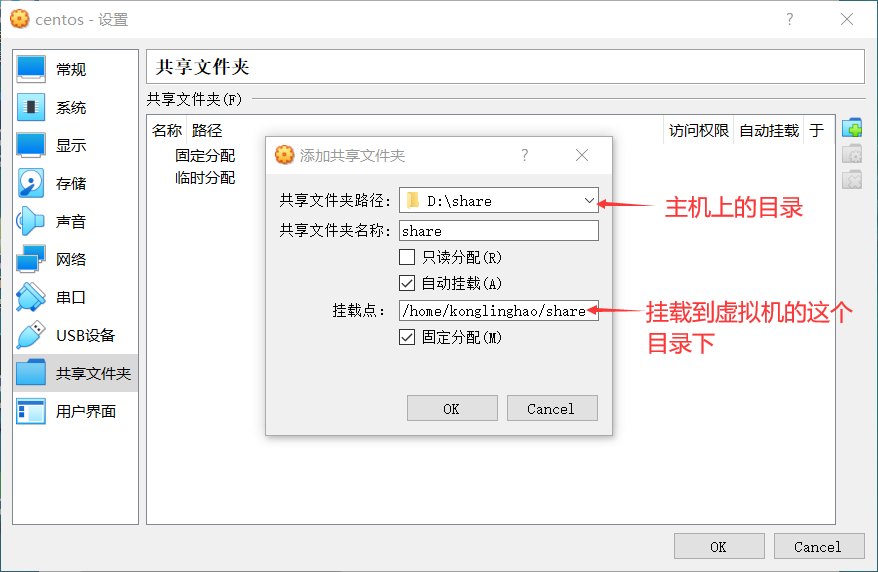

# 1、Linux的安装与配置

## 1-1 初识 Linux

### 电脑启动的顺序：

- 第一步：启动界面（主板）
- 第二步：操作系统（例如 Windows）的启动
- 第三步：其他程序（或称软件）的启动

### 能否在一台电脑上有两个（甚至更多）的 OS？

- 一台电脑可以拥有多个 OS
- 当启动界面结束以后，会有一个被成为 `bootloader` 的程序显示出来
- `bootloader`让你做出选择，到底选择哪个操作系统来启动

### 什么是 bootloader?

- boot（表示 “启动”），loader（表示 “加载器”）
- 通过这段小程序，初始化硬件设备、建立内存空间的映射图
- 为最终调用操作系统内核准备好正确的环境
- 通常 `bootloader`是严重依赖于硬件而实现的，特别在嵌入式领域
- 一般在 Linux 和 Windows 之间做出选择的 `bootloader` 叫 GRUB
- 如果没有做出选择，GRUB 在几秒之后就会启动默认的操作系统

### 不同操作系统上的程序

- Windows 的程序在 Linux 下不能运行，反之亦然
- 有些技术使 Windows 的程序在 Linux 下可以运行，例如 Wine
- 但终归是使用转为 Linux 定制的程序比较好

### Linux 上的程序有很多优点

- 免费：基本上 Linux 上的所有程序都是免费的
- 更新频繁，更新也是免费的
- 不少程序的 Linux 版更优秀，有些程序没有 Windows 版

## 1-2 linux 的不同发行版

### GNU 项目

- GNU 在英语里是 “牛羚” 的意思
- GNU 是 “GNU is Not Unix” 的递归缩写
- 1984年，理查德·斯托曼 创立了 GNU 项目
- GNU 项目在当时的首要目的是创立一个类 Unix 的操作系统
- Unix 需要复刻，因为它不是免费的

### Linus Torvalds（李纳斯·特沃兹）

- 1991年他在业余时间百年写了一个类 Unix 的内核
- Linux 这个名字可以说是 Linus 和 Unix 的合并
- Linux 也可以说是 “Linux Is Not Unix” 的递归缩写

### Linux 和 GNU 项目的联系

- 这两个项目是互补的：Linus 其实就是写了一个类 Unix 的内核
- 1991年，GNU 项目已经创建了不少操作系统的外围软件了
- GNU 的软件：cp 命令，rm 命令，Emacs，GCC，GDB等
- 后来完善 Linux 的工作交给了 Linus 和广大开源社区的黑客们
- GNU 项目 + Linux（系统内核）= **GNU/Linux** 完整的操作系统

### 总结

- 操作系统的核心称为 “内核”，但内核并不就等于操作系统
- 内核提供系统服务，比如文件管理、虚拟内存、设备 I/O 等
- 还包含一些基本的程序，例如 文本编辑器，编译器，外壳程序 shell
- 单独的 Linux 内核没办法工作，需要有 GNU 项目的众多应用程序
- Linux 的官方称谓应该是 “**GNU/Linux**”，一般简称 **Linux**
- [内核官网](https://www.kernel.org/)

### Linux 发行版

- 因为是开源自由的，Linux 不像 Windows 这么死板，可以自己定制自己的 Linux 系统
- Linux 发行版：因为太自由了这让初学者犯难，究竟该选择哪个版本，安装哪些软件？这个时候就有了发行版，这为了简化用户安装的过程，以及提供一些基本的软件
- 这种 “发行版” 的概念在 Windows 可以说没有

### Linux 发行版之间的主要区别

- 其实内核都是一样的，就是装饰不一样，是 Linux 的变体
- 安装方法不一样：有的复杂，有的简单
- 安装应用程序的方式不一样
- 预装的程序不一样

### 不同的 Linux 发行版

- Red Hat：性能稳定，老牌的 Linux 发行版。收费的是 RHEL。
- Fedora：Red Hat 的社区免费后继版。
- CentOS：算是 RHEL 的克隆版，免费。
- Deepin：**中国**发行。对优秀的开源产品进行集成和配置，开发软件。
- Debian：算是迄今为止，最遵循 GNU 规范的 Linux 系统。
- Ubuntu：Debian 的后继或一个分支。

### Red Hat 家族主要成员

- RHEL：Red Hat 企业版
- Fedora：Red Hat 的社区免费后继版
- CentOS：RHEL 的克隆版，免费。结合了 RHEL 和 Fedora 的特性

## 1-3 Linux 的多面性、定制自由

### 第一面：免费

- windows收费，而 Linux 免费

### Linux 的两种界面

- 不论是哪一个 Linux 发行版，都有两种使用 Linux 的方式。
- 1、命令行界面（类似 DOS 操作系统）
- 2、图形界面（类似 Windows 操作系统）
  - Linux 有多种图形界面。它们都基于一个程序：**X**
  - X 程序是 Linux 图形界面的基石
  - 在 X 程序之上，插入了另一个程序，叫做 “桌面管理器”，其作用是管理窗口，以及它们的外观，选项等等（在 Windows 下并没有 “桌面管理器” 这个概念）
  - 主流的桌面管理器
    - Gnome
    - KDE
    - XFDE

## 1-4 CentOS 下载

- [下载网址](https://www.centos.org/download/)

## 1-5 虚拟机安装 CentOS

### 虚拟技术/虚拟化（Virtualization）

- 一种通过组合或分区现有的计算机资源（CPU、内存、磁盘空间等），使得这些资源表现为一个或多个操作环境，从而提供优于原有资源配置的访问方式的技术。

### 安装 VirtualBox

- VirtualBox 是一款开源虚拟机软件，免费
- **在 Windows 下面下载需要进入 BIOS 开启虚拟化**（我的好像不用）

**VirtualBox对比 VMWare**

- VMWare 的各种版本，安装文件很大；VirtualBox 占用资源少
- VMWare 收费

### 创建虚拟机


### 在虚拟机中安装 centos 系统


## 1-6 配置虚拟机中的 CentOS


### 安装增强功能


若出现了错误：

> VirtualBox安装增强功能时报错：未能加载虚拟光盘 到虚拟电脑

那就进入命令行，然后输入 eject 命令来弹出光盘，然后再执行安装增强功能（重启以后才有用）。




# 2、Linux基础知识和命令

## 2-1 关于终端界面

问题：

- 为什么要发明终端，而不是一开始就用图形界面？
  - 因为计算机一开始的时候计算能力不强。
- 为什么需要终端？
  - 为了节省时间

```
例子：一个目录里有多个文件，你想知道有多少个 JPEG 类型的图片。在图形界面里可能会有点麻烦；
在终端里一句命令搞定：ls -l | grep jpg | wc -l
```

### 什么是 tty？

- 在 Linux 中， TTY 也许是跟终端有关系的最为混乱的术语
- TTY 是 TeleTYpe 的一个缩写
- Teletypes，或者 teletypewriters ，原来指的是电传打字机
- 我的理解，tty就是个真正的全屏幕终端

### 登录 tty 的快捷键

- ctrl + alt + f1：**回到图形界面**
- ctrl + alt + f2：terminal 1 (:0  大致等于 tty1)
- ctrl + alt + f3：terminal 2（tty2）
- ctrl + alt + f4：terminal 3（tty3）
- ctrl + alt + f5：terminal 4（tty4）
- ctrl + alt + f6：terminal 5（tty5）

## 2-2 命令行

- 命令行：Command Line。

### 命令行提示符

- **[konglinghao@localhost ~]$** 是命令提示符， 可以看成电脑在对你打招呼，说 “你好”，提示你要开始写东西了。
- konglinghao 是当前用户的名字。Linux 是多用户的操作系统（windows 也是）。
- @ 后面的是所在的域。localhost 是主机的名字。
- ~ 是当前所在目录的名字，会随着用户进入不同目录而改变
- ~ 表示当前用户的家目录（home directory）
- $ 指示你所具有的权限
  - $表示普通用户，拥有有限的权限
  - #表示超级用户，拥有所有权限

### 简单的命令

- date 用于显示当前时间
- ls 是 list 的缩写，用于列出当前目录下的文件和目录

### 命令的参数

- 参数是写在命令之后的一些补充选项。命令和参数之间要有空格隔开。
- 格式：command parameters
- 参数里可以包含多个参数，由空格隔开
- 参数也可以包含数字，字母，等等
- 参数没有固定的格式，但是一般来说还是遵循一定的规范

### 短参数（一个字母）

- 最常用的参数形式就是一个短横线后接一个字母：command -p
- 一次可以加好几个短参数，可以用空格隔开：command -p -a -T -c
- 多个短参数可以合并到一起：command -paTc
- 字母的大小写有区别，大写的 T 和小写的 t 通常含义不同
- 举一个实际的例子：ls -a；参数中的 a 是 all 的意思（包含隐藏文件，linux 里面以 . 开头的就是隐藏文件）

### 长参数（多个字母）

- 长参数没有短参数那么常用，但也是很有用的，以两个短横线开始
- 格式：command --parameter
- 多个长参数不能合并写，要用空格隔开：command --parameter1 --parameter2
- 可以组合使用短参数和长参数：command -paTc --parameter1
- 有时候同一个意义的参数有长参数和短参数两种形式：ls -a 和 ls --all 意思一样

### 参数赋值

- 有一些参数需要赋值。短参数和长参数赋值方式不一样
- 短参数赋值：command -p 19
- 长参数赋值：command --parameter=10


# 3、Linux进阶知识和命令


# 4、远程连接和SSH


# 5、文本编辑与版本控制


# 6、网络和安全


# 7、Shell脚本编程


# 8、管理服务器和服务


# 9、Linux开发神器


# 10、内存与磁盘管理


